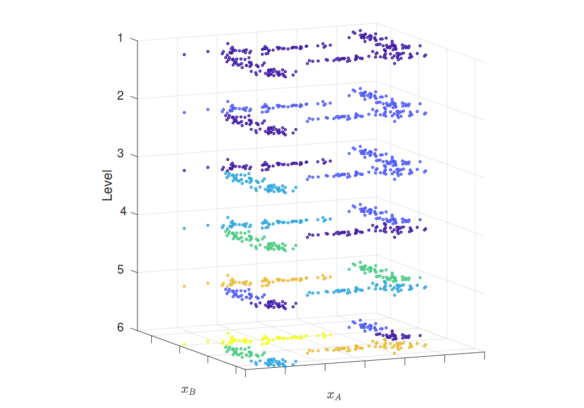

Hugo 的 LaTex 公式渲染有点毛病，这个页面上的显示效果可能存在问题。

如果你需要这篇笔记的 PDF 版本，**可 [点击这里](https://sharrybyte.lanzoub.com/iRc9Q2m81guf) 下载**。

## 前言【Week1-1】

### 机器学习（统计学习）的定义

机器学习或统计学习通常被定义为： Machine or statistical learning is
usually defined as:

从原始**数据**中提取模式以获取**知识**的能力。 The ability to acquire
**knowledge** by extracting patterns from raw **data**. (Goodfellow,
Bengio, Courville)

用于**建模**和**理解**复杂**数据集**的一组工具。 A set of tools for
**modeling** and **understanding** complex **datasets**. (James, Witten,
Hastie, Tibshirani)

### 数据的定义

数据是**观察或测量**的具体化。 **Data** is the materialisation of an
**observation** or a **measurement**.

数据集是按照一组**预定义属性描述的项**集合格式化的数据。 **Datasets**
are data formatted as collections of **items** described by a set of
pre-defined **attributes**.

在机器学习中，我们的数据总是**以数据集的形式表示**。 In machine
learning, our data is always **represented as a dataset.**

### 知识的表示

知识可以表示为 Knowledge can be represented as

**命题（陈述、定律）** **Proposition (statement, law)**

**叙述（描述、故事）** **Narrative (description, story)**

**模型（数学或计算机）** **Model (mathematical or computer)**

模型描述了属性之间的关系。\
Models describe relationships between attributes.

数学模型和计算机模型是等价的：\
Mathematical and computer models are equivalent:

数学模型可以实现为计算机程序。\
Mathematical models can be implemented as computer programs.

每个计算机模型都有对应的数学表达式。\
Every computer model has a corresponding mathematical expression.

### 数据科学

科学不在于使用复杂的仪器、数学或技术，而在于评估我们的知识。 Science is
not about using sophisticated instrumentation, maths or techniques,
science is about evaluating our knowledge.

我们在此评估中使用数据与公认的知识。 We use data together with accepted
knowledge in this evaluation.

命题本身并无科学或不科学之分，关键在于我们如何评估它们。 Propositions
are not scientific or unscientific, but the way we evaluate them.

如果没有数据，就没有机器学习。 If there is no data, there is no machine
learning.

这并不意味着机器学习仅仅是关于数据的。 This doesn't mean machine
learning is all about data.

具体来说，不存在中立或客观的数据来揭示真相。 Specifically, there is no
such thing as neutral or objective data that speaks the truth.

我们需要遵循**严格的方法论**。 We need to follow a **rigorous
methodology**.

### 机器学习的两种观点

许多机器学习从业者采用**数据集优先**的观点：我们从数据集开始，然后（制定问题并最终）生成模型。
Many machine learning professionals adopt a **dataset-first** view: we
start with a dataset, then (formulate a problem and finally) produce a
model.

在CBU5201中，**我们采用部署优先（问题优先）的方法**：我们从问题开始，然后获取数据集，最后生成模型。
In CBU5201 we use a **deployment-first (problem-first) approach**: we
start with a problem, then secure a dataset and finally produce a model.

因此，我们将机器学习定义为：一套使用数据用于解决科学、工程和商业问题的工具和方法论...
Accordingly, we define machine learning as: A set of tools together with
a methodology for solving scientific, engineering and business problems
using data

### 机器学习的两个阶段

模型可以被构建、销售和部署以提供**价值**。\
Models can be built, sold, and deployed to deliver **value**.

在模型的生命周期中，我们可以区分两个阶段：\
During the life of a model, we can distinguish two stages:

1.  学习阶段：模型被构建。

    Learning stage: The model is built.

2.  部署阶段：模型被使用。

    Deployment stage: The model is used.

### 基本方法论

在机器学习中，我们关注的是找到在部署时有效的模型。因此，除了构建模型外，我们还需要验证其有效性。\
In machine learning, we are interested in finding models that work
during deployment. Hence, in addition to building a model, we need to
check it works.

基本的机器学习方法论包括两个独立的任务：\
Basic machine learning methodologies include two separate tasks:

**训练**：使用数据和质量指标创建模型。我们也可以说我们将模型拟合到数据集。\
**Training**: A model is created using data and a quality metric. We
also say that we fit a model to a dataset.

**测试**：使用新的、未见过的数据评估模型在部署时的性能。\
**Testing**: The performance of the model during deployment is assessed
using new, unseen data.

如果没有严格的方法论，模型很可能几乎没有用处。\
Without rigorous methodologies, models are very likely to be of little
use.

### 机器学习的分类

#### 监督学习 Supervised Learning

在监督学习中，我们给定一个新项目，其中一个属性的值对我们来说是未知的。\
In supervised learning, we are given a new item such that the value of
one of its attributes is unknown to us.

我们的目标是通过从已知项目的集合中学习来估计缺失的值。\
Our goal is to estimate the missing value by learning from a collection
of known items.

挑战在于构建一个模型，该模型将一个属性x（称为预测变量）映射到另一个属性y（我们称之为标签），使用一个带标签的数据集。\
The challenge is then to build a model that maps one attribute x, known
as the predictor, to another attribute y, which we call the label, using
a dataset of labelled examples.

监督学习根据标签的类型进一步分为两类： Supervised learning is further
divided into two categories depending on the type of label:

-   **分类**：标签是**离散**变量。 **Classification**: The label is a
    discrete variable.
-   **回归**：标签是**连续**变量。 **Regression**: The label is a
    continuous variable.

#### 无监督学习 Unsupervised Learning

在无监督学习中，我们致力于**发现数据集的潜在结构**。\
In unsupervised learning, we set out to **find the underlying
structure** of our dataset.

这有助于我们获得理解、识别异常、压缩数据并减少处理时间。\
This can be useful to gain understanding, identify anomalies, compress
our data and reduce processing time.

数据集的基础结构可以通过**结构分析**来研究，其中包括： The underlying
structure of a dataset can be studied using **structure analysis**,
which includes:

-   **聚类分析**：专注于数据点的分组。 **Cluster analysis**: Focuses on
    groups of data points.
-   **成分分析**：识别感兴趣的方向。 **Component analysis**: Identifies
    directions of interest.
-   **密度估计技术**提供了描述样本在属性空间中分布的统计模型。 **Density
    estimation techniques** provide statistical models that describe the
    distribution of samples in the attribute space.

无监督学习的一些应用实例：

-   客户细分。 Customer segmentation.

-   社交社区检测。 Social community detection.

-   推荐系统。 Recommendation systems.

-   进化分析。 Evolutionary analysis.

## 回归 Regression I 【Week 1-2】

### 问题形成

回归是一个**监督学习**问题：我们的目标是使用剩余属性（**预测变量**）来预测一个属性（**标签**）的值。
Regression is a **supervised** problem: Our goal is to predict the value
of one attribute (**label**) using the remaining attributes
(**predictors**).

标签是一个**连续**变量。 The label is a **continuous** variable.

我们的任务是**找到最佳模型**，该模型可以为给定的预测变量集分配唯一的标签。
Our job is then to **find the best model** that assigns a unique label
to a given set of predictors.

我们使用由**标记样本**组成的**数据集**。 We use **datasets** consisting
of **labelled samples**.

### 关联与因果

预测模型有时被通过**因果视角**解释：预测因子是**原因**，标签是其**结果**。然而这是**不正确的**。
Prediction models are sometimes interpreted through a causal lens: the
predictor is the cause, the label its effect. However this is not
correct.

我们构建预测器的能力源于属性之间的**关联**，而非**因果**关系。 Our
ability to build predictors is due to association between attributes,
rather than causation.

数据集中的两个属性出现关联的原因可能是： Two attributes in a dataset
appear associated due to:

-   一个属性导致另一个属性（直接或间接）。 If one causes the other
    (directly or indirectly).

-   两者有共同的原因。 When both have a common cause.

-   由于我们收集样本的方式（抽样）。 Due to the way we collect samples
    (sampling).

关键信息：在机器学习中，我们不构建因果模型！ Take-home message: In
machine learning we don't build causal models!

### 模型质量指标

To find the best model, we need a notion of model quality.\
为了找到最佳模型，我们需要一个模型质量的概念。

The squared error \$ e_i\^2 = (y_i - `\hat{y}`{=tex}\_i)\^2 \$ is a
common quantity used in regression to encapsulate the notion of single
prediction quality.\
平方误差 \$ e_i\^2 = (y_i - `\hat{y}`{=tex}\_i)\^2 \$
是回归中常用的量，用于概括单个预测质量的概念。

Two quality metrics based on the squared error are the sum of squared
errors (SSE) and the mean squared error (MSE), which can be computed
using a dataset as:\
基于平方误差的两个质量指标是误差平方和（SSE）和均方误差（MSE），可以使用数据集计算如下：

$E_{SSE} = e_1^2 + e_2^2 + \cdots + e_N^2 = \sum_{i=1}^{N}e_i^2$

$E_{MSE} = \frac{1}{N} \sum_{i=1}^{N}e_i^2$

### 误差是自然存在的

在回归问题中，我们需要注意：\
When considering a regression problem, we need to be aware:

-   选择的**预测变量可能不包括所有决定标签的因素**。\
    The chosen predictors might not include all factors that determine
    the label.

-   选择的**模型可能无法表示**响应与预测变量之间的真实关系（模式）。\
    The chosen model might not be able to represent the true
    relationship between response and predictor (the pattern).

-   **随机机制**（噪音）可能存在。\
    Random mechanisms (noise) might be present.

在数学上，我们将这种差异表示为：\
Mathematically, we represent this discrepancy as:

$y = \hat{y} + e   = f(x) + e$

真实标签 y 与模型预测 f (x) 之间总会存在一些误差（误差 e）。\
There will always be some discrepancy (error e) between the true label y
and our model prediction f(x).

### 将回归视作优化问题

即：找出最小MSE的模型。

$f_{best}(x)=\arg\min_f\frac{1}{N}\sum_{i=1}^N\left(y_i-f(x_i)\right)^2$

### 回归学习阶段模型

**先验知识：**线性、多项式等类型的模型\
Type of model (linear, polynomial, etc).

**数据：**标记样本（特征和真值标签）\
Labelled samples (predictors and true label).

**模型：**基于特征预测标签\
Predicts a label based on the predictors.

### 简单线性回归

简单**线性**回归模型通过以下数学表达式定义： In simple linear
regression, models are defined by the mathematical expression:

$f(x)=w_0+wx_1$

因此，预测标签 $\hat{y}$ 可以表示为 Hence, the predicted label $\hat{y}$
can be expressed as

$\hat{y_i}f(x_i)=w_0+w_1x_i$

因此，一个线性模型有**两个参数wo（截距）和w1（斜率）**，**需要调整这些参数以达到最高质量**。
A linear model has therefore two parameters wo (intercept) and w1
(gradient), which need to be tuned to achieve the highest quality.

在机器学习中，我们用**数据集**来调整这些参数。 In machine learning, we
use a dataset to tune the parameters.

我们说我们在**训练模型或将模型拟合到训练数据集上**。 We say that we
train the model or fit the model to the training dataset.

### 简单多项式回归

多项式回归模型的一般形式是： The general form of a polynomial regression
model is:

$f(x_i) = w_0 + w_1x_i + w_2x_i^2 + \cdots + w_Dx_i^D$

这里，$D$ 是多项式的阶数。 where $D$ is the degree of the polynomial.

多项式回归定义了**一组包含多种模型的族。** Polynomial regression defines
**a family of families of models.**

对于每个 $D$ 值，我们都有一个不同的族：$D=1$ 对应于线性的族，$D=2$
对应于二次的，$D=3$ 对应于三次的，以此类推。 For each value of $D$, we
have a different family: $D=1$ corresponds to the linear family, $D=2$
to the quadratic, $D=3$ to the cubic, and so on.

我们称 $D$ 为一个**超参数**。 We call $D$ a **hyperparameter**.

这意味着其设定的值会产生一个不同的族，具有不同的参数合集。 What it means
is that setting its value results in a different family, with a
different collection of parameters.

## 回归 Regression II 【Week 1-3】

### 多元回归 Multiple Regression

多元回归拥有两个或更多的预测变量。

数学表示为：

$\boldsymbol{x}_i=[1,x_{i,1},x_{i,2},\ldots,x_{i,K}]^T$

$\hat{y_i}=f(x_i)$

### 多元线性回归

$f(x_i)=w^Tx_i=w_0+w_1x_{i,1}+\cdots+w_Kx_{i,K}$

where $w = [w_0, w_1,...,w_K]^T$ is the model's parameter vector.

Note that we can use the same vector notation for simple linear
regression models, by defining $\boldsymbol{w} = [w_0, w_1]^T$ and
$\boldsymbol{x}_i = [1,x_i]^T.$

训练数据集可以表示为设计矩阵X： In multiple linear regression, the
training dataset can be represented by the design matrix X:

$$\begin{gathered}\mathbf{X}\quad=\quad[\boldsymbol{x}_1,\ldots,\boldsymbol{x}_N]^T=\begin{bmatrix}\boldsymbol{x}_1^T\\\boldsymbol{x}_2^T\\\vdots\\\boldsymbol{x}_N^T\end{bmatrix}=\begin{bmatrix}1&x_{1,1}&x_{1,2}&\ldots&x_{1,K}\\1&x_{2,1}&x_{2,2}&\ldots&x_{2,K}\\\vdots&\vdots&\vdots&\ddots&\vdots\\1&x_{N,1}&x_{N,2}&\ldots&x_{N,K}\end{bmatrix}\end{gathered}$$

和标签矩阵y and the label vector y:

$$\boldsymbol{y}\quad=\quad[y_1,\ldots,y_N]^T=\begin{bmatrix}y_1\\y_2\\\vdots\\y_N\end{bmatrix}$$

### 最小二乘解

对训练数据集，线性模型的最小MSE的解析解有如下表示：

$\boldsymbol{w}_{best}=\left(\mathbf{X}^{T}\mathbf{X}\right)^{-1}\mathbf{X}^{T}y$

$(\mathbf{X}^T\mathbf{X})^{-1}$ 在X中的所有列线性独立时存在。

### 其他回归模型

线性模型和多项式模型并不是唯一可用的选项。 Linear and polynomial models
are not the only options available.

其他可以使用的模型家族包括： Other families of models that can be used
include:

-   指数模型 Exponential

-   正弦模型 Sinusoids

-   径向基函数 Radial basis functions

-   样条模型 Splines

数学公式是相同的，只有f(⋅)的表达式发生变化。 The mathematical
formulation is identical and only the expression for f(⋅) changes.

### 逻辑函数

在某些问题中，标签代表一个比例或概率，即一个介于0和1之间的量。\
In some problems, the label represents a proportion or a probability,
i.e. a quantity between 0 and 1.

此外，这个量可能会随着预测变量的增加而增加。\
Moreover, this quantity might increase as the predictor increases.

在这种情况下，逻辑函数可能会很有用。\
In such cases, the logistic function can be useful.

$p(d)=\frac{e^d}{1+e^d}=\frac{1}{1+e^{-d}}$

### 其他质量指标

均方根RMSE【表征预测值误差的标准差】：$E_{RMSE}=\sqrt{\frac{1}{N}\sum e_i^2}$

MAE【表征预测值的误差的绝对值平均】：$E_{MAE}=\frac{1}{N}\sum|e_i|$

R方【测量响应中可从预测变量预测的方差比例】：$E_R=1-\frac{\sum e_i^2}{\sum(y_i-\bar{y})^2}\mathrm{,where~}\bar{y}=\frac{1}{N}\sum y_i$

### 灵活性 Flexibility

模型允许我们通过调整其参数生成多种形状。 Models allow us to generate
multiple shapes by tuning their parameters.

我们通过模型的自由度或复杂度来描述其生成不同形状的能力，即其灵活性。 We
talk about the degrees of freedom or the complexity of a model to
describe its ability to generate different shapes, i.e. its flexibility.

模型的灵活性与可解释性和准确性相关，并且在两者之间存在权衡。 The
flexibility of a model is related to its interpretability and accuracy,
and there is a trade-off between the two.

模型的训练数据集质量与其灵活性相关。 The quality of a model on a
training dataset is also related to its flexibility.

在训练过程中，灵活性较高的模型产生的误差通常较低。 During training, the
error produced by flexible models is in general lower.

### 可解释性 interpretability

模型的可解释性对于我们人类以定性的方式理解预测器如何映射到标签至关重要。
Model interpretability is crucial for us, as humans, to understand in a
qualitative manner how a predictor is mapped to a label.

不灵活的模型通常产生更简单且更容易解释的解决方案。 Inflexible models
produce solutions that are usually simpler and easier to interpret.

### 泛化 Generalisation

泛化能力是指我们的模型能够成功地将学习阶段所掌握的知识应用到实际部署中的能力。
Generalisation is the ability of our model to successfully translate
what we was learnt during the learning stage to deployment.

### 欠拟合与过拟合

通过比较模型在训练和部署期间的表现，我们可以观察到三种不同的行为： By
comparing the performance of models during training and deployment, we
can observe three different behaviours:

-   欠拟合：训练和部署时产生较大的误差。模型无法捕捉到潜在的模式。过于简单的模型会导致欠拟合。
    Underfitting: Large training and deployment errors are produced. The
    model is unable to capture the underlying pattern. Rigid models lead
    to underfitting.
-   过拟合：训练时产生较小的误差，部署时产生较大的误差。模型在记忆无关的细节。过于复杂的模型和不足的数据会导致过拟合。
    Overfitting: Small errors are produced during training, large errors
    during deployment. The model is memorising irrelevant details. Too
    complex models and not enough data lead to overfitting.
-   恰到好处：训练和部署时产生较低的误差。模型能够重现潜在的模式并忽略无关的细节。
    Just right: Low training and deployment errors. The model is capable
    of reproducing the underlying pattern and ignores irrelevant
    details.

泛化能力只能通过**比较训练和部署性能**来评估，而**不仅仅是看每个模型对训练数据**的拟合程度。\|
Generalisation can only be assessed by comparing training and deployment
performance, not by just looking at how each model fits the training
data.

## 方法论 【Week 1-4】

### 从目标采样数据集

-   数据集需要**具有代表性**，即提供目标群体的完整画面。\
    Datasets are representative, i.e., provide a complete picture of the
    target population.\
-   采样需模拟部署期间生成样本的机制：样本需要独立提取。\
    Sampling mimics the mechanism that generates samples during
    deployment: Samples need to be extracted independently.

样本需要**独立且同分布（iid）**。\
Samples need to be **independent and identically distributed (iid).**

### 评估部署时性能

每个机器学习项目都需要包含一个**在部署期间**评估模型性能的策略。\
Every machine learning project needs to include a strategy to evaluate
the performance of a model during deployment.

在机器学习中，性能评估策略包括：\
In machine learning, a performance evaluation strategy includes:

1.  用于量化性能的**质量指标。**\

2.  A quality metric used to quantify the performance.

3.  如何利用**数据**来评估模型的性能。\

4.  How data will be used to assess the performance of a model.

性能评估策略必须在创建模型**之前**设计，以避免陷入数据陷阱，例如确认偏差。\
The performance evaluation strategy has to be designed before creating a
model to avoid falling into our own data-traps, such as confirmation
bias.

我们使用数据的子集，即**测试数据集**，来计算测试**部署性能**，作为真实性能的**估计**。
We use a subset of data, the test dataset, to compute the test
deployment performance as an estimation of the true performance.

测试数据集是随机抽取的，因此**测试性能**本身也是**随机**的，因为不同的数据集通常会产生不同的值。
Test datasets are extracted randomly. Hence, the test performance is
itself random, as different datasets generally produce different values.

模型由不同团队构建，可以根据它们的测试性能进行比较。 Models built by
different teams can be compared based on their test performances.

需要注意的是，测试性能是一个随机量，因此某些模型可能**偶然表现得更好**！
Caution should be used, as the test performance is a random quantity,
hence some models might appear to be superior by chance!

### 优化理论

优化使我们能够在所有候选模型中识别出在目标群体上实现最高质量的模型，即**最优模型**
Optimization allows us to identify among all the candidate models the
one that achieves the highest quality on the target population, i.e. the
optimal model.

### 误差曲面

误差曲面（也称为误差、目标、损失或成本函数）用E(w)表示，它将每个候选模型w映射到其误差。
The error surface (a.k.a. error, objective, loss or cost function)
denoted by E(w) maps each candidate model w to its error.

我们假设可以通过目标群体的理想描述来获得它。 We will assume that we can
obtain it using the ideal description of our target population.

最优模型可以通过最低误差来识别。\
The optimal model can be identified as the one with the lowest error.

误差表面的梯度（斜率）在最优模型处为零。\
The gradient (slope) of the error surface is zero at the optimal model.

因此，我们可以通过找到梯度为零的位置来寻找最优模型。\
Hence, we can look for it by identifying where the gradient is zero.

### 梯度下降 Gradient descent

梯度下降是一种数值优化方法，通过**迭代更新**模型参数，利用误差曲面的梯度进行调整。
Gradient descent is a numerical optimization method where we iteratively
update our model parameters using the gradient of the error surface.

梯度提供了误差增加最快的方向。利用梯度，我们可以创建以下更新规则： The
gradient provides the direction along which the error increases the
most. Using the gradient, we can create the following update rule:

$w_\mathrm{new}=w_\mathrm{old}-\epsilon\nabla E(w_{old})$

其中$\epsilon$被称为**学习率或步长**。 where $\epsilon$ is known as the
learning rate or step size.

在每次迭代中，我们调整模型的参数w。因此，这个过程也被称为**参数调优**。
With every iteration, we adjust the parameters w of our model. This is
why this process is also known as parameter tuning.

### 学习率

学习率$\epsilon$控制我们在每次梯度下降迭代中改变模型参数w的程度。\
The learning rate $\epsilon$ controls how much we change the parameters
w of our model in each iteration of gradient descent.

-   较小的$\epsilon$值会导致模型收敛到最优解的速度较慢。\
    Small values of $\epsilon$ result in slow convergence to the optimal
    model.\
-   较大的$\epsilon$值可能会使模型错过最优解。\
    Large values of $\epsilon$ risk overshooting the optimal model.

可以采用自适应方法，使学习率逐渐减小。\
Adaptive approaches can be implemented, where the value of the learning
rate decreases progressively.

### 梯度下降开始与停止

梯度下降开始时，我们需要一个初始模型。初始模型的选择可能至关重要。初始参数
w 通常**随机选择**（但在合理的值范围内）。\
To start gradient descent, we need an initial model. The choice of the
initial model can be crucial. The initial parameters w are usually
chosen randomly (but within a sensible range of values).

一般来说，梯度下降不会达到最优模型，因此需要设计一个停止策略。常见的选择包括：\
In general, gradient descent will not reach the optimal model, hence it
is necessary to design a stopping strategy. Common choices include:

-   迭代次数。\
    Number of iterations.\

-   处理时间。\
    Processing time.

-   误差值。\
    Error value.

-   误差值的相对变化。\
    Relative change of the error value.

### 局部解与全局解

误差表面可以是复杂的，并且具有 Error surfaces can be complex and have

-   局部最优（在某个区域内误差最小的模型）。 local optima (the model
    with the lowest error within a region).
-   全局最优（在所有模型中误差最小的模型）。 Global optima (the model
    with the lowest error among all the models).

梯度下降可能会陷入局部最优。为了避免这种情况，我们可以从多个初始模型开始重复该过程，并选择最佳结果。
Gradient descent can get stuck in local optima. To avoid them, we can
repeat the procedure from several initial models and select the best.

### 训练ML模型

现在问题是，误差曲面不是给定的，我们只有数据。

我们使用数据的一个子集，即训练数据集，来（隐式或显式）重建优化过程中所需的误差表面。我们将其称为经验误差表面。
We use a subset of data, known as the training dataset, to (implicitly
or explicitly) reconstruct the error surface needed during optimisation.
We will call this the empirical error surface.

经验误差和真实误差表面通常不同。\
The empirical and true error surfaces are in general different.

因此，它们的最优模型可能不同，即训练数据集上的最佳模型可能不是总体上的最佳模型。\
Hence, their optimal models might differ, i.e. the best model for the
training dataset might not be the best for the population.

### 训练集与最小均方

可以在训练集上使用最小均方作为指标来优化模型。

$\hat{y}=\mathrm{X}w$

得到均方函数

$\begin{aligned}E_{MSE}(w)&=\quad\frac{1}{N}\left(y-\hat{y}\right)^T\left(y-\hat{y}\right)\\&=\quad\frac{1}{N}\left(y-\mathrm{X}w\right)^T\left(y-\mathrm{X}w\right)\end{aligned}$

得到均方函数的梯度：

$\nabla E_{MSE}(w)=\frac{-2}{N}\mathrm{X}^T\left(y-\mathrm{X}w\right)$

此梯度在$w=\left(\mathbf{X}^T\mathbf{X}\right)^{-1}\mathbf{X}^Ty.$时为零。

### 暴力穷举

通常，我们无法获得解析解。\
In general, we will not have analytical solutions.

我们可以通过在训练数据上评估每个模型来重建经验误差表面。\
We can reconstruct the empirical error surface by evaluating each model
on training data.

这被称为暴力搜索或穷举搜索。\
This is called brute-force or exhaustive search.

方法简单，但通常不实用。\
Simple, but often impractical.

### 由数据驱动的梯度下降

梯度下降可以通过使用训练数据集来估计梯度来实现。\
Gradient descent can be implemented by estimating the gradient using our
training dataset.

在每次迭代中，使用训练数据集的一个子集（批次）来计算误差表面的梯度。\
During each iteration, a subset (**batch**) of the training dataset is
used to compute the gradient of the error surface.

根据每次迭代中使用的数据量，通常（尽管并不十分有用）可以区分以下几种方法：
Depending on the amount of data used in each iteration, it is common
(although not really useful) to distinguish between:

-   批量梯度下降（使用整个训练数据集）。 Batch gradient descent (the
    whole training dataset is used).

-   随机（或在线）梯度下降（使用一个样本）。 Stochastic (or online)
    gradient descent (one sample is used).

-   小批量梯度下降（使用训练数据集中的一小部分）。 Mini-batch gradient
    descent (a small subset from the training dataset is used).

更实用的方法是讨论**批量大小**（一个介于1和训练数据集大小之间的数字）。无论批量大小的值如何，我们都会使用**随机梯度下降**这个术语来指代这种方法。
It is more useful to talk about the batch size (a number between 1 and
the size of the training dataset). Irrespective of the value of the
batch size, we will use the term stochastic gradient descent for this
approach.

小批量会产生经验误差表面梯度的噪声版本，这有助于逃离局部最小值。 Small
batches produce noisy versions of the gradient of the empirical error
surface, which can help to escape local minima.

### 其他基于梯度的优化方法

随机梯度下降是最常用的优化算法，尽管有时可能较慢。\
Stochastic gradient descent is the most used optimisation algorithm,
although it can sometimes be slow.

其他流行的基于梯度的优化算法包括：\
Other popular gradient-based optimisation algorithms include:

-   **动量法**定义了更新步骤的速度（方向和大小），这取决于过去的梯度。\
    **Momentum** defines a velocity (direction and speed) for the update
    step, which depends on past gradients.\
-   **RMSProp**通过使用过去的梯度来缩放学习率。\
    **RMSProp** adapts the learning rate by scaling them using the past
    gradients.\
-   **Adam**结合了动量法和RMSProp的一些特性。\
    **Adam** combines some features from the Momentum and RMSProp
    approaches.

### 经验误差曲面和过拟合

经验误差曲面和真实误差曲面通常是不同的。\
The empirical and true error surfaces are in general different.

当使用小数据集和复杂模型时，两者之间的差异可能非常大，导致训练出的模型在经验误差曲面上表现很好，但在真实误差曲面上表现很差。\
When small datasets and complex models are used, the differences between
the two can be very large, resulting in trained models that work very
well for the empirical error surface but very poorly for the true error
surface.

这当然是从另一个角度来看**过拟合**问题。\
This is, of course, another way of looking at **overfitting**.

通过增加训练数据集的规模，经验误差曲面会接近真实误差曲面，从而降低过拟合的风险。\
By increasing the size of the training dataset, empirical error surfaces
become closer to the true error surface and the risk of overfitting
decreases.

**切勿**使用相同的数据进行测试和训练模型。\
Never use the same data for testing and training a model.

测试数据集需要保持**不可访问**，以避免在训练过程中（有意或无意地）使用它。\
The test dataset needs to remain inaccessible to avoid using it
(inadvertently or not) during training.

### 正则化 Regularisation

正则化通过添加一个约束模型参数取值的项来修改经验误差表面。
Regularisation modifies the empirical error surface by adding a term
that constrains the values that the model parameters can take on.

$E_R(w)=E(w)+\lambda w^Tw$

例如，MSE的正则化：

$E_{MSE+R}=\frac{1}{N}\sum_{i=1}^Ne_i^2+\lambda\sum_{i=1}^Kw_k^2$

解为：$w=\left(\mathbf{X}^T\mathbf{X}+N\lambda\mathbf{I}\right)^{-1}\mathbf{X}^Ty$

随着正则化强度的增加，所得解的复杂度降低，过拟合的风险也随之减小。 As
the regularization strength increases, the complexity of the resulting
solution decreases, and so does the risk of overfitting.

### （训练期间）成本与质量

正则化提供了一个例子，我们在训练期间使用了一种质量概念（EMSE+R），而在部署期间使用了不同的质量概念（EMSE）。这听起来是不是有点奇怪？
Regularisation provides an example where we use a notion of quality
during training (EMSE+R) that is different from the notion of quality
during deployment (EMSE). Doesn't it sound strange?

我们的目标始终是生成一个在部署期间达到最高质量的模型。我们如何实现它，则是另一个问题。
Our goal is always to produce a model that achieves the highest quality
during deployment. How we achieve it, is a different question.

诸如过拟合等因素可能导致模型在训练期间表现最优，但在部署期间却并非如此。一个设计良好的训练期间质量概念可以生成在部署期间表现更好的模型。
Factors such as overfitting might result in models that are optimal
during training, but not deployment. A well-designed notion of quality
during training can produce models that perform better during
deployment.

我们通常将训练期间的质量概念称为**成本或目标函数**，以区别于**目标质量指标**。
We usually call our notion of quality during training cost or objective
function, to distinguish it from the target quality metric.

### 验证模型

验证方法允许我们使用数据来评估和选择不同的模型家族。用于验证的相同数据随后可以用于训练最终模型。\
Validation methods allow us to use data for assessing and selecting
different families of models. The same data used for validation can then
be used to train a final model.

验证涉及每个模型族的一轮或多轮训练和性能估计，随后进行性能平均。\
Validation involves one or more training and performance estimation
rounds per model family followed by performance averaging.

验证集方法是最简单的方法。它将可用数据集随机分为**训练集和验证集**（或保留集）。
The validation set approach is the simplest method. It randomly splits
the available dataset into a training and a validation (or hold-out)
dataset.

模型使用训练部分进行拟合，验证部分用于估计其性能。 Models are fitted
with the training part and the validation part is used to estimate its
performance.

### 验证方法（数据集切分方法）

验证集方法涉及一次训练轮次。然而，模型使用较少的样本进行训练，最终性能由于随机分割而具有高度可变性。\
The validation set approach involves one training round. Models are
however trained with fewer samples and the final performance is highly
variable due to random splitting.

-   **留一法交叉验证（LOOCV，Leave-one-out
    cross-validation）**需要与数据集中的样本数量相同的训练轮次，然而在每一轮中几乎所有的样本都用于训练。它始终提供相同的性能估计。\
    LOOCV requires as many training rounds as samples there are in the
    dataset, however in every round almost all the samples are used for
    training. It always provides the same performance estimation.\
    
-   **k折交叉验证**是最流行的方法（将数据集切分成K份）。它比留一法交叉验证涉及更少的训练轮次。与验证集方法相比，性能估计的变异性更小，并且更多的样本用于训练。\
    k-fold is the most popular approach. It involves fewer training
    rounds than LOOCV. Compared to the validation set approach, the
    performance estimation is less variable and more samples are used
    for training.
    

## 分类 Classication I 【Week 2-1】

### 问题形成

在机器学习分类问题中：\
In a machine learning classification problem:

我们使用数据集 $\{(x_i,y_i):1\leq i\leq N\}$ 构建模型 $\hat{y}=f(x)$。\
We build a model $\hat{y}=f(x)$ using a dataset
$\{(x_i,y_i):1\leq i\leq N\}$.

我们有一个模型质量的概念。\
We have a notion of model quality.

对 $(x_i,y_i)$ 可以理解为"样本 $i$ 属于类别 $y_i$"，或者"样本 $i$
的标签是 $y_i$"。\
The pair $(x_i,y_i)$ can be read as "sample $i$ belongs to class $y_i$",
or "the label of sample $i$ is $y_i$".

分类问题有二分类、多类分类等类型。数据集成为预测变量和标签对。

### 在标签空间下的数据集

### 在预测变量空间下的数据集

### 判决域

在分类问题中，我们使用预测空间中的**决策区域**的概念。\
In classification problems, we use the notion of **decision regions** in
the predictor space.

-   决策区域由**与相同标签相关联的点**组成。\
    A decision region is made up of points that are associated to the
    same label.\
-   可以通过识别其**边界**来定义区域。\
    Regions can be defined by identifying their boundaries.\
-   分类中的解决方案模型是将预测空间**划分为由决策边界分隔的**决策区域。\
    A solution model in classification is a partition of the predictor
    space into decision regions separated by decision boundaries.

### 线性分类器

线性分类器使用决策区域之间的线性边界：\
Linear classifiers use linear boundaries between decision regions:

线性边界由线性方程 \$ w\^T x = 0 \$ 定义。\
Linear boundaries are defined by the linear equation \$ w\^T x = 0 \$.

扩展向量 \$ x = \[1, x_1, x_2...\]\^T \$ 包含预测变量，\$ w \$
是系数向量。\
The extended vector \$ x = \[1, x_1, x_2...\]\^T \$ contains the
predictors and \$ w \$ is the coefficients vector.

为了对样本进行分类，我们只需确定它位于边界的哪一侧。\
To classify a sample we simply identify the side of the boundary where
it lies.

如果我们知道线性边界的系数向量 $\mathbf{w}$，分类一个样本就非常简单： If
we know the coefficients vector $\mathbf{w}$ of a linear boundary,
classifying a sample is very simple:

-   构建扩展向量 $\mathbf{x}_i$。

-   Build the extended vector $\mathbf{x}_i$.

-   计算 $\mathbf{w}^T \mathbf{x}_i$。

-   Compute $\mathbf{w}^T \mathbf{x}_i$.

-   **使用以下事实进行分类：**

-   **Classify using the following facts:**

    -   如果 $\mathbf{w}^T \mathbf{x}_i > 0$，我们在边界的一侧。

    -   If $\mathbf{w}^T \mathbf{x}_i > 0$, we are on one side of the
        boundary.

    -   如果 $\mathbf{w}^T \mathbf{x}_i < 0$，我们在边界的另一侧！

    -   If $\mathbf{w}^T \mathbf{x}_i < 0$, we are on the other!

    -   如果 $\mathbf{w}^T \mathbf{x}_i = 0$...
        我们在哪里？（恰在边界上）

    -   If $\mathbf{w}^T \mathbf{x}_i = 0$... where are we?

### 基本质量指标

通过比较预测值和真实标签，我们可以在数据集中识别出： By comparing
predictions and true labels, we can identify in a dataset:

-   每个类别中正确分类的样本（真实预测）。 The correctly classified
    samples (true predictions) in each class.
-   每个类别中错误分类的样本（错误预测）。 The incorrectly classified
    samples (false predictions) in each class.

两个常见且等效的质量指标是**准确率A和错误率（或误分类率）E = 1 −
A**，定义为： Two common and equivalent notions of quality are the
accuracy A and the error (or misclassification) rate E = 1 − A, defined
as:

**A = 正确分类的样本数 / 总样本数** **A = #correctly classified samples
/ #samples**

**E = 错误分类的样本数 / 总样本数** **E = #incorrectly classified
samples / #samples**

### 逻辑回归模型

给定一个线性边界 $\mathbf{w}$ 和一个预测向量 $\mathbf{x}_i$，量
$\mathbf{w}^T \mathbf{x}_i$ 可以解释为样本到边界的**距离**。 Given a
linear boundary $\mathbf{w}$ and a predictor vector $\mathbf{x}_i$, the
quantity $\mathbf{w}^T \mathbf{x}_i$ can be interpreted as the distance
from the sample to the boundary.

如果我们在逻辑函数中设 $d = \mathbf{w}^T \mathbf{x}_i$，我们得到：\_
\_If we set $d = \mathbf{w}^T \mathbf{x}_i$ in the logistic function, we
get:

\$ p(`\mathbf{w}`{=tex}\^T `\mathbf{x}`{=tex}\_i) =
`\frac{e^{\mathbf{w}^T \mathbf{x}_i}}{1 + e^{\mathbf{w}^T \mathbf{x}_i}}`{=tex}
\$

对于固定的 $\mathbf{w}$，我们简记为 $p(\mathbf{x}_i)$：\_ \_For a fixed
$\mathbf{w}$, we will simply denote it as $p(\mathbf{x}_i)$ to simplify
the notation:

-   当 $\mathbf{w}^T \mathbf{x} \rightarrow \infty$ 时，逻辑函数
    $p(\mathbf{x}_i) \rightarrow 1$

-   When $\mathbf{w}^T \mathbf{x} \rightarrow \infty$, the logistic
    function $p(\mathbf{x}_i) \rightarrow 1$

-   当 $\mathbf{w}^T \mathbf{x} \rightarrow -\infty$ 时，逻辑函数
    $p(\mathbf{x}_i) \rightarrow 0$

-   When $\mathbf{w}^T \mathbf{x} \rightarrow -\infty$, the logistic
    function $p(\mathbf{x}_i) \rightarrow 0$

线性分类器 $w$ 对样本进行标记：\
A linear classifier $w$ labels samples:

-   如果 $w^T x_i > 0$，则标记为"正类"。\

-   If $w^T x_i > 0$, then label as "positive".

-   如果 $w^T x_i < 0$，则标记为"负类"。\

-   If $w^T x_i < 0$, then label as "negative".

关键点：\
Key points to notice:

-   如果 $w^T x_i = 0$（点 $x_i$ 在边界上），则 $p(x_i) = 0.5$。\

-   If $w^T x_i = 0$ (the point $x_i$ is on the boundary), then
    $p(x_i) = 0.5$.

-   如果 $w^T x_i > 0$（点 $x_i$
    在正类区域），则随着远离边界，$p(x_i) \rightarrow 1$。\

-   If $w^T x_i > 0$ (the point $x_i$ is in the positive region), then
    $p(x_i) \rightarrow 1$ as it moves away from the boundary.

-   如果 $w^T x_i < 0$（点 $x_i$
    在负类区域），则随着远离边界，$p(x_i) \rightarrow 0$。\

-   If $w^T x_i < 0$ (the point $x_i$ is in the negative region), then
    $p(x_i) \rightarrow 0$ as it moves away from the boundary.

关键结论：\
Here is the crucial point:

-   $p(x_i)$ 是分类器对 $y_i$ 为正类的确信度。\

-   $p(x_i)$ is the classifier's certainty that $y_i$ is positive.

-   $1 - p(x_i)$ 是分类器对 $y_i$ 为负类的确信度。\

-   $1 - p(x_i)$ is the classifier's certainty that $y_i$ is negative.

### 参数化与非参数化方法

线性分类器属于参数化方法家族：假设一种形状（在这种情况下是线性的），并使用我们的数据集在所有具有预选形状的边界中找到最佳边界。\
Linear classifiers belong to the family of parametric approaches: a
shape is assumed (in this case linear) and our dataset is used to find
the best boundary amongst all the boundaries with the preselected shape.

非参数化方法提供了一种更灵活的替代方案，因为它们不假设任何类型的边界。
Non-parametric approaches offer a more flexible alternative, as they do
not assume any type of boundary.

### 最近邻

新样本被分配为**最接近（最相似）的训练样本的标签**。\
New samples are assigned the label of the closest (most similar)
training sample.

-   边界没有明确定义（尽管它们存在并且可以获取）。\
    Boundaries are not defined explicitly (although they exist and can
    be obtained).\
-   整个训练数据集需要被**记忆**。这就是为什么我们有时说最近邻是一种**基于实例的方法**。\
    The whole training dataset needs to be memorised. That's why
    sometimes we say NN is an instance-based method.

### K近邻

K近邻算法（kNN）是最近邻算法的一个简单扩展，其过程如下：\
K-Nearest Neighbors (kNN) is a simple extension of the nearest neighbors
algorithm, which proceeds as follows:

-   给定一个新样本x：\
    Given a new sample x:\

-   我们计算它与所有训练样本xi的距离。\
    We calculate the distance to all the training samples xi.

-   提取K个最近的样本（邻居）。\
    Extract the K closest samples (neighbors).\

-   获取属于每个类别的邻居数量。\
    Obtain the number of neighbors that belong to each class.\

-   将样本x的标签分配为邻居中最常见的类别。\
    Assign the label of the most popular class among the neighbors.

KNN的特点：

-   存在一个隐式的边界，尽管它不用于分类新样本。\
    There is always an implicit boundary, although it is not used to
    classify new samples.

-   随着K的增加，边界变得不那么复杂。我们从过拟合（小K）转向欠拟合（大K）分类器。\
    As K increases, the boundary becomes less complex. We move away from
    overfitting (small K) to underfitting (large K) classifiers.\

-   在二分类问题中，K的值通常是一个奇数。这是为了防止样本的最近邻中一半属于每个类别的情况。\
    In binary problems, the value of K is usually an odd number. The
    idea is to prevent situations where half of the nearest neighbours
    of a sample belong to each class.\

-   kNN可以轻松地应用于多分类场景。\
    kNN can be easily implemented in multi-class scenarios.

## 分类 Classication II 【Week 2-2】

### 先验概率、后验概率与贝叶斯分类器

### 先验概率（Prior Probability）

先验概率是指在没有任何额外信息的情况下，某个事件发生的概率。它通常基于已有的知识或经验。例如，在分类问题中，先验概率
$P(C)$ 表示类别 $C$ 在没有任何特征信息的情况下出现的概率。

### 后验概率（Posterior Probability）

后验概率是指在观察到某些证据或特征后，某个事件发生的概率。在分类问题中，后验概率
$P(C|X)$ 表示在观察到特征 $X$ 后，类别 $C$ 出现的概率。

### 贝叶斯定理（Bayes' Theorem）

贝叶斯定理是计算后验概率的基础，其公式为： $$
P(C|X) = \frac{P(X|C) \cdot P(C)}{P(X)}
$$ 其中： - $P(C|X)$ 是后验概率，即在观察到特征 $X$ 后类别 $C$
的概率。 - $P(X|C)$ 是似然（Likelihood），即在类别 $C$ 下观察到特征 $X$
的概率。 - $P(C)$ 是先验概率，即类别 $C$ 的概率。 - $P(X)$
是证据（Evidence），即特征 $X$ 的概率，通常可以通过全概率公式计算： $$
P(X) = \sum_{i} P(X|C_i) \cdot P(C_i)
$$
### 贝叶斯分类器（Bayesian Classifier）

贝叶斯分类器是一种基于贝叶斯定理的分类方法。它的基本思想是：给定一个样本的特征
$X$，计算每个类别 $C$ 的后验概率
$P(C|X)$，然后将样本分配到后验概率最大的类别。

具体步骤如下： 1. **计算先验概率**：根据训练数据估计每个类别的先验概率
$P(C)$。 2. **计算似然**：估计在给定类别 $C$ 下特征 $X$ 的似然
$P(X|C)$。 3. **计算证据**：计算特征 $X$ 的概率 $P(X)$。 4.
**计算后验概率**：使用贝叶斯定理计算每个类别的后验概率 $P(C|X)$。 5.
**分类决策**：将样本分配到后验概率最大的类别。

### 朴素贝叶斯分类器（Naive Bayes Classifier）

朴素贝叶斯分类器是贝叶斯分类器的一种简化版本，它假设特征之间是条件独立的。即：
$$
P(X|C) = \prod_{i=1}^{n} P(x_i|C)
$$ 其中 $x_i$ 是特征 $X$ 的第 $i$ 个分量。

朴素贝叶斯分类器的后验概率公式为： $$
P(C|X) = \frac{P(C) \cdot \prod_{i=1}^{n} P(x_i|C)}{P(X)}
$$
由于 $P(X)$
对于所有类别是相同的，因此在分类决策时可以忽略它，只需比较分子部分： $$
C_{\text{pred}} = \arg\max_{C} P(C) \cdot \prod_{i=1}^{n} P(x_i|C)
$$

-   **先验概率** $P(C)$ 是在没有任何特征信息的情况下类别 $C$ 的概率。
-   **后验概率** $P(C|X)$ 是在观察到特征 $X$ 后类别 $C$ 的概率。
-   **贝叶斯分类器** 通过计算后验概率来进行分类决策。
-   **朴素贝叶斯分类器** 假设特征之间条件独立，简化了计算。

可以达到**最佳准确率**

### 判别分析 Discriminant analysis

在判别分析中，我们假设各类别的密度是**高斯分布**。如果有一个预测变量
$x$，则类别A的密度为： $$
p(x|y = A) = \frac{1}{\sigma_A\sqrt{2\pi}}e^{-\frac{1}{2}\left(\frac{x-\mu_A}{\sigma_A}\right)^2}
$$ 其中 $\mu_A$ 是**均值**，$\sigma^2_A$ 是高斯分布的**方差**。

如果有 $K$ 个预测变量，高斯类的密度表示为： $$
p(x|y = A) = \frac{1}{(2\pi)^{p/2}|\Sigma_A|^{1/2}}e^{-\frac{1}{2}(x-\mu_A)^T\Sigma_A^{-1}(x-\mu_A)}
$$ 这里 $x = [x_1, \dots, x_K]^T$ 包含所有的预测变量，$\mu_A$
是**均值**，$\Sigma_A$ 是**协方差矩阵**。

对于类别A的密度，可以得到类似的表达式。

当类密度满足高斯分布的时候，利用两个分类的协方差矩阵判断，如果相等就是Linear
Discriminant Analysis（线性判别分析）(LDR)，如果不相等就是Quadratic
Discriminant Analysis（二次判别分析）(QDA)

### 比较学过的分类器

**边界形状**：逻辑回归和LDA构建线性边界，QDA构建二次边界。kNN不施加任何特定形状

**稳定性**：对于样本较少的情况，逻辑回归可能非常不稳定，而DA方法产生稳定的解决方案。

**异常值**：逻辑回归对位于边界之外的样本表现出稳健性，而LDA和QDA可能会受到影响。

**多分类**：在判别分析中，多分类问题可以很容易被实现。

**先验知识**：可以容易地通过贝叶斯方法整合进去。

### 拓展贝叶斯分类器

即加入错判的代价作为参数

改变T会改变分类器边界。得到的结果是能够达到**最低错判成本**。

### 混淆矩阵

在**类别敏感**问题中，准确率和错误率并不是最合适的质量指标，因为不同类别的样本被错误分类的成本是不同的。\
In class-sensitive problems, accuracy and error rate are not the most
suitable quality metrics, as the cost of misclassifying samples from
different classes varies.

除了使用每个类别的**错误分类成本**外，我们还可以评估分类器在处理每个类别时的表现。这正是**混淆矩阵或列联表**所展示的信息。\
In addition to using the misclassification cost for each class, we can
assess how well the classifier deals with each class individually. This
is precisely the information that a confusion or contingency matrix
shows.

对角线上是正确分类的结果，其他位置是错误分类的结果。

对于二分类任务：

### 其他指标

错误率和准确率是无法让我们研究分类器如何处理每个类别的性能指标。 Error
rate and accuracy are performance rates that do not allow us to
investigate how a classifier treats each class.

-   **灵敏度（召回率或真阳性率）**：TP/(TP+FN) Sensitivity (recall or
    true positive rate): TP/(TP+FN)
-   **特异性（真阴性率）**：TN/(TN+FP) Specificity (true negative rate):
    TN/(TN+FP)
-   **精确率（阳性预测值）**：TP/(TP+FP) Precision (positive predictive
    value): TP/(TP+FP)

这些指标可以用作质量指标。 These rates can be used as quality metrics.

单独提升一个质量指标很容易。例如，如果我们将每个样本都标记为正例，就能达到完美的灵敏度。
Improving one quality metric individually is easy. For instance, if we
label every sample as positive, we would achieve a perfect sensitivity.

问题在于，**提升一个质量指标会损害其他指标**。 The problem is that
improving one quality metric deteriorates others.

我们通常同时考虑成对的质量指标：\
We usually consider pairs of quality metrics simultaneously:

-   敏感性和特异性。\
    Sensitivity and specificity.\
-   精确率和召回率。\
    Precision and recall.

### F1 Score

F1分数是另一个广泛使用的性能指标，它提供了精确率和召回率之间的平均值。\
The F1-score is another widely used performance metric that provides an
average between precision and recall. $$
F_1 = 2 \times \frac{\text{precision} \times \text{recall}}{\text{precision} + \text{recall}}
$$
### ROC

ROC（受试者工作特征）平面用于表示分类器在敏感性和1-特异性方面的性能。
The ROC (Receiver Operating Characteristic) plane is used to represent
the performance of a classifier in terms of its sensitivity and
1-specificity.

我们希望灵敏度接近1，1-特异性接近0（左上角）。 We would like the
sensitivity to be close to 1 and the 1-specificity to be close to 0 (top
left corner).

我们**无法同时使用两个指标**对分类器进行排序。\
We **cannot rank classifiers** using two metrics simultaneously.

通常的做法是固定其中一个指标的最小值，并优化另一个指标，例如：在特异性至少为70%的情况下获得最高的灵敏度。\
The usual practice is to fix a minimum value for one of the metrics and
optimise the other, for instance: obtain the highest sensitivity with a
minimum specificity of 70%.

**AUC（曲线下面积）**是衡量可校准分类器性能的指标。\
**The AUC (Area Under the Curve)** is a measure of goodness for a
classifier that can be calibrated.

好的分类器的AUC接近1，差的分类器接近0.5。 Good classifiers will have AUC
close to 1, bad classifiers close to 0.5.

## 方法论 Methodology II【week 3-1】

### 流水线 Pipeline

管道（pipeline）描述了一系列操作的顺序。 The term pipeline describes a
sequence of operations.

（有监督的）机器学习管道是使用一组预测变量（输入）生成预测（输出）的操作序列。
A (supervised) machine learning pipeline is the sequence of operations
that produce a prediction (output) using a set of predictors (input).

我们可以从每张图片中提取特征（例如萼片长度和宽度，花瓣长度和宽度），并构建一个以这些特征为输入的线性模型。
We can extract features from each picture (e.g., sepal length and width,
petal length and width) and build a linear model that takes these
features as input.

机器学习解决方案不仅仅是一个模型。\
Machine learning solutions are more than just one model.

它们可以包含多个阶段，形成一个**处理管道**：\
They can include several stages that form a processing pipeline:

-   转换阶段（处理输入数据）。\
    Transformation stages (where input data is processed).

-   多个机器学习模型并行运行。\
    Several machine learning models running in parallel.

-   最终聚合阶段（将各个输出组合成一个单一输出）。\
    A final aggregation stage (where individual outputs are combined to
    produce one single output).

-   训练后，管道的参数**保持不变**。\
    After training, the parameters of a pipeline remain fixed.\

-   管道可以被测试和部署。\
    Pipelines can be tested and deployed.

-   预测的质量取决于所有管道阶段。\
    The quality of the prediction depends on all the pipeline stages.

### 数据标准化 Normalization

距离的概念是许多机器学习技术的基础：\
The notion of distance is behind many machine learning techniques:

-   在回归中，预测误差 4 e_i = y_i - `\hat{y}`{=tex}\_i \$
    可以被视为一种距离。\
    In regression, the prediction error \$ e_i = y_i -
    `\hat{y}`{=tex}\_i \$ can be seen as a distance.\
-   在分类中，我们使用了样本与边界之间的距离（逻辑回归），以及样本之间的距离（kNN）。\
    In classification, we used the distance between samples and
    boundaries (logistic regression), and between samples (kNN).\
-   在聚类中，K-means 聚类是基于样本与原型之间的距离创建的。\
    In clustering, K-means clusters were created based on the distance
    between samples and prototypes.\
-   在密度估计中，标准差量化了样本与样本均值之间的平均距离。\
    In density estimation, the standard deviation quantifies the average
    distance between samples and the sample mean.

数值表示对我们的数据有影响，可能会影响最终模型和算法的性能。\
The numerical representations of our data can have an impact on the
final model and the performance of our algorithms.

### 最小最大归一化 Min-max normalisation

产生在0到1范围内的值

### 标准化 Standardisation

产生的结果均值为0，标准差为1

### 标准化相关

-   在测试和部署过程中，我们应预料到会出现超出范围的值（例如，在最小-最大归一化中，z
    = 1:2）。\
    During test and deployment, we should expect out-of-range values
    (e.g., z = 1:2 in min-max normalization).\

-   异常值可能会产生负面影响（例如，一个比第二大值大10倍的异常值会将最小-最大归一化压缩到\[0;
    0.1\]）。\
    Outliers can have a negative impact (e.g., an outlier 10 times
    larger than the second largest value will squeeze min-max
    normalization to \[0; 0.1\]).

-   存在非线性缩放选项，例如使用逻辑函数的Softmax缩放或对数缩放。\
    Non-linear scaling options exist, for instance, softmax scaling,
    which uses the logistic function, or logarithmic scaling.\

-   原始数据集中的值可能具有相关性。\
    The original values in your dataset might be relevant.

-   通常，我们需要考虑意外的效果和扭曲。\
    In general, we need to consider unintended effects and distortions.

-   许多机器学习算法在缩放后可能会产生不同的解决方案。\
    Many machine learning algorithms might produce different solutions
    after scaling.

### 转换 Transformation

数据转换是通过改变样本的表示方式来进行的数据操作。\
Transformations are data manipulations that change the way that we
represent our samples.

它们可以被视为将样本从一个空间移动到另一个空间。\
They can be seen as moving samples from one space to another.

**归一化是单独对每个属性进行操作的一种转换示例**：它应该作为我们流水线中的另一个阶段。
Normalisation is one example of a transformation that operates on each
attribute separately: it should be included as another stage in our
pipeline.

在某些变换中，原始空间和目标空间具有**相同的维度**。\
In some transformations, the original and destination spaces have the
same number of dimensions.

-   线性变换可以看作是旋转和缩放。\
    A linear transformation can be seen as a rotation and scaling.\
-   非线性变换没有唯一的描述。\
    There is no unique description for non-linear transformations.

如果目标空间的维度少于原始空间，我们称之为**降维**。\
If the destination space has fewer dimensions than the original one, we
talk about dimensionality reduction.

-   特别是在特征选择后，目标空间由原始属性的子集定义。\
    In particular, after feature selection, the destination space is
    defined by a subset of the original attributes.\
-   在特征提取中，新属性被定义为对原始属性的操作。\
    In feature extraction, the new attributes are defined as operations
    on the original attributes.

### 主成分分析 PCA

主成分分析（PCA）识别样本对齐的**方向**。\
Principal components analysis (PCA) identifies the directions along
which samples are aligned.

这些方向定义了一个与原始空间维度相同的目标空间。\
These directions define a destination space with the same number of
dimensions as the original space.

使用数据集，PCA构建了一个**线性变换**，并为每个成分分配了一个分数。\
Using a dataset, PCA builds a linear transformation and additionally
assigns a score to each component.

### 非线性变换

一种适用于先前示例的解决方案可以是一个由以下部分组成的管道： A solution
for the previous example could be a pipeline consisting of:

-   一个合适的非线性变换。 A suitable non-linear transformation.

-   随后是第二层线性分类器。 Followed by a second layer of linear
    classifiers.

-   最后是一个实现逻辑函数的单元。 A final unit implementing a logical
    function.

该管道在原始空间中产生圆形边界。 This pipeline produces circular
boundaries in the original space.

### 复杂模型&Kernel方法 Complex models and kernel methods

许多复杂的机器学习模型实际上可以被视为一个变换后接一个简单模型。 Many
complex machine learning models can in fact be interpreted as a
transformation followed by a simple model.

-   我们知道如何变换数据，只需要学习在目标空间上操作的模型。 We know how
    to transform our data and only need to learn the model that operates
    on the destination space.

-   我们不知道变换，因此也需要学习它。 We don't know the transformation,
    hence we need to learn it too.

这可能涉及通过验证选择正确的变换，或通过训练调整给定变换的参数。 This
can involve selecting the right transformation (via validation) or
tuning the parameters of a given transformation (via training).

核方法，如支持向量机，使用所谓的核函数隐式定义这种变换。 Kernel methods,
such as support vector machines, implicitly define such transformations
using so-called kernel functions.

### 降维 Dimensionality reduction

可以使用PCA先进行降维，然后构建模型。

### 特征选择

特征选择是一种减少数据集维度的方法，它假设**只有原始属性的一个子集是相关的**。
Feature selection is a method to reduce the dimensionality of a dataset
that assumes that only a subset of the original attributes are relevant.

为了选择最相关的特征，我们需要能够为不同的特征子集分配一个分数。 To
select the most relevant features, we need to be able to assign a score
to different subsets of features.

-   如果我们的数据集有M个属性，总共有2\^M −
    1个子集可以考虑（例如，如果我们的数据集有10个属性，我们大约有1000个选项）。
    If our dataset has M attributes, there are a total of 2\^M − 1
    subsets that we could consider (e.g., If our dataset has 10
    attributes, we have roughly 1000 options).
-   在监督学习中，我们可以使用我们的目标指标来评估一个属性子集的相关性。
    What do we mean by relevant? In supervised learning, we can use our
    target metric to evaluate how relevant a subset of attributes is.
-   我们仍然需要在每个特征子集上训练一个模型。最终的相关性还取决于我们训练模型的能力。
    We still need a model trained on each subset of features. The final
    relevance will also depend on our ability to train a model.
-   特征选择可以被看作是一种验证形式，其中我们选择使用不同属性子集的模型。
    Feature selection can be seen as a form of validation, where we
    select models that use different subset of attributes.

#### Filtering

最简单的特征选择方法是单独考虑每个属性。\
The simplest approach to feature selection is to consider each attribute
individually.

可以通过拟合模型并获取其验证性能来分配分数。\
A score can be assigned by fitting a model and obtaining its validation
performance.

然后选择最佳组件。\
Then, the best components are selected.

但是可能效果不好

#### Wrapping

如果我们怀疑特征之间的交互可能至关重要，我们别无选择，只能**一起评估它们**，而不是分开评估。
If we suspect that the interaction between features might be crucial, we
have no choice but to evaluate them together, rather than separately.

包装方法通过以下方式考虑预测变量之间可能的交互： Wrapping approaches
consider possible interaction between predictors by:

-   训练具有**不同特征子集**的模型 Training a model with different
    subsets of features
-   使用**验证**方法评估每个生成的模型 Evaluating each resulting model
    by using validation approaches
-   选择具有**最高验证性能**的子集 Picking the subset with the highest
    validation performance.

贪婪搜索可以用来减少选项的数量。\
Greedy search can be used to reduce the number of options.

### 特征提取 Feature extraction

特征提取可以显著降低数据集的维度，通过使用一些精心设计的特征来总结数据集。
Feature extraction can reduce dramatically the dimensionality of a
dataset summarising it using a few well-designed features.

### 集成 Ensembles

集成方法允许我们创建一个结合基础模型优势的新模型。 Ensemble methods
allow us to create a new model that combines the strengths of base
models.

基础模型需要尽可能多样化，可以通过以下方式创建： Base models need to be
as diverse as possible and can be created by:

-   使用数据的随机子集训练一系列模型。 Training a family of models with
    random subsets of the data.

-   使用属性的随机子集训练不同的模型。 Training different models with
    random subsets of attributes.

-   训练完全不同的模型家族。 Training different families of models
    altogether.

#### Bagging

Bootstrap 是一种从数据集中提取随机样本的统计方法。 Bootstrap is a
statistical method that extracts random samples from a dataset.

给定一个训练数据集，Bagging 通过自助法生成 K
个子数据集，并使用每个子数据集训练 K 个简单的基础模型。 Given a training
dataset, bagging generates K sub-datasets by bootstrapping and trains K
simple base models with each sub-dataset.

最终的模型 f(x) 通过对基础模型 fk(x) 的预测结果进行平均或投票来组合。
The final model f(x) combines the predictions of the base models fk(x)
by averaging or voting.

#### Decision trees

决策树分类器通过仅使用一个预测变量实施一系列分割规则，将预测空间划分为多个决策区域。\
Decision tree classifiers partition the predictor space into multiple
decision regions by implementing sequences of splitting rules using one
predictor only.

这导致了一种可以表示为树的算法。\
This leads to an algorithm that can be represented as a tree.

决策树的构建：

在决策树中，**根节点**对应于整个未分割的数据集，而**叶节点**是其中一个决策区域。\
In a decision tree, the root corresponds to the whole, unpartitioned
dataset and a leaf is one of the decision regions.

-   目标是创建**纯净的叶节点**，即尽可能包含来自同一类别的样本。\
    The goal is to create pure leaves, i.e. containing as many samples
    from the same class as possible.\
-   在分类过程中，样本被分配到其所在叶节点中的多数类别。\
    During classification, a sample is assigned to the majority class in
    the leaf where the sample is located.

决策树是**递归**构建的：从根节点开始，我们递归地**将每个区域分割成两部分**。\
Decision trees are built recursively: Starting from the root, we
recursively split each region into two.

-   分割是**轴平行的**（使用**一个预测变量**进行决策）。\
    Splits are axis-parallel (decisions using one predictor).\
-   选择的分割方式使得结果区域的纯度高于任何其他分割方式。\
    The chosen split is such that the purity of the resulting regions is
    higher than any other split.\
-   当满足给定条件时停止，例如区域中的样本数量。\
    We stop when a given criterion is met, such as the number of samples
    in a region.

决策树无法解决XOR问题

决策树的问题：

树模型简单且能轻松处理数值型和类别型预测变量。 Trees are simple and can
handle easily both numerical and categorical predictors.

-   然而，树模型存在记忆训练样本的风险，即过拟合。 However, trees run
    the risk of memorising training samples, i.e. overfitting.

-   剪枝技术和停止准则可以帮助防止过拟合。 Pruning techniques and stop
    criteria can help to prevent this.

-   不同的训练数据集可能导致不同的树结构。 Different training datasets
    can lead to a different tree structures.

-   某些分类问题可以很容易地表示为树，但树可能难以学习（例如异或问题）。
    Some classification problems can be easily represented as a tree,
    but the tree might be hard to learn (e.g. XOR).

使用随机森林集成决策树可以解决这些问题。

#### 随机森林

随机森林通过随机化训练样本和预测器来训练许多单独的树。预测是通过对各个预测进行平均得到的。\
Random forests train many individual trees by randomising the training
samples and the predictors. Predictions are obtained by averaging the
individual predictions.

它们通常具有很高的准确性，但训练成本较高，并且比单棵树更难解释。\
In general they have great accuracy, but can be expensive to train and
are harder to interpret than a single tree.

#### Boosting

Boosting
采用了一种不同的方法：它生成一系列简单的基础模型，其中每个后续模型都专注于前一个模型无法正确处理的数据样本。
Boosting follows a different approach: it generates a sequence of simple
base models, where each successive model focuses on the samples that the
previous models could not handle properly.

## 神经网络与深度学习【Week 3-2】

### 模式与结构

模式是我们数据中的规律性，而结构是目标群体中的规律性。 Patterns are
regularities in our data, and structure is a regularity in our target
population.

机器学习项目依赖于通过识别数据中的模式来发现潜在结构。 Machine learning
projects rely on discovering the underlying structure by identifying
patterns in data.

### The Curse of Dimensionality

维度灾难是一个警告。无关的属性不会相互抵消，它们会表现为虚假的模式。添加更多属性（以防万一）实际上可能导致模型性能变差。我们可以使用特征选择技术来降低问题的维度。
The curse of dimensionality is a warning. Irrelevant attributes do not
cancel each other out, they show up as spurious patterns. Adding more
attributes (just in case) can actually result in worse-performing
models. We can use feature selection techniques to reduce the
dimensionality of the problem but first, let's use our domain knowledge.

### 神经网络

神经网络是一种受人类神经系统启发而设计的计算系统，通常作为机器学习模型家族的一部分。\
A neural network is a computing system loosely inspired by the human
nervous system, commonly used as a family of Machine Learning models.

从计算角度来看，神经网络由相互连接的单位组成，这些单位（松散地）模仿神经元。这种架构具有吸引力，因为：
From a computational angle, neural networks consist of interconnected
units that (loosely) mimic neurons. This architecture is appealing
since:

-   神经科学表明，生物神经网络可以解决任何问题。 Neuroscience suggests
    biological neural networks can solve any problem.
-   数学表明，人工神经网络可以再现任何输入/输出关系，只要它们足够复杂。
    Mathematics suggests artificial neural networks can reproduce any
    input/output relationship, provided they are complex enough.
-   因此，神经网络模型家族可以被视为一种通用机器。 Hence, the family of
    neural network models can be seen as a universal machine.

### 感知器 perceptron

感知器是神经网络的基本单元。\
The perceptron is the basic unit of a neural network.

它由一个权重向量 w 和一个激活函数 h(⋅) 定义，将扩展向量 x 映射到输出
a。\
It is defined by a weight vector w and an activation function h(⋅) that
map an extended vector x to an output a.

系数 w0 被称为偏置。\
The coefficient w0 is known as the bias.

激活函数一般是非线性的。

### 层 Layer

层是使用相同输入的感知器的集合。 A layer is a collection of perceptrons
that use the same input.

层中的每个感知器都会产生一个独立的输出。 Each perceptron within a layer
produces a separate output.

由 L 个感知器和 K 个输入组成的一层有 L × (K + 1)个权重。

### 架构 Architecture

神经网络的架构描述了各层之间的连接方式。\
The architecture of a neural network describes how layers are connected.

输入层是预测向量，隐藏层生成内部特征，输出层生成预测结果。\
The input layer is the predictor vector, hidden layers produce internal
features, and the output layer produces the prediction.

### 神经网络

-   神经网络由按架构连接的感知器层组成。 A neural network consists of
    perceptrons arranged in layers that are connected according to an
    architecture.

-   每个连接有一个参数（连接的权重）。 There is one parameter per
    connection (the connection's weight).

-   每一层生成中间特征。 Each layer produces intermediate features.

-   层数决定了神经网络的深度（因此区分了浅层神经网络和深层神经网络）。
    The number of layers determines the depth of the neural network
    (hence the distinction between shallow and deep neural networks).

### 感知器作为线性分类器

使用阶跃函数作为激活函数，则得到线性分类器

### 感知器实现逻辑门功能

激活函数为阶跃函数。

### 感知器实现网格模式检测

### 结合线性分类器和逻辑功能可以得到：

### 从计算角度看待神经网络

从认知角度来看，大型神经网络具有吸引力，因为它们为我们提供了创建新的、日益复杂的概念所需的**灵活性**，这些概念可能对做出预测至关重要。\
From a cognitive point of view, large neural networks are appealing, as
they give us the necessary flexibility to create new and increasingly
complex concepts that might be relevant to make a prediction.

然而，更高的灵活性增加了**过拟合**的风险（我们可以将其视为网络创建和使用无关概念）。\
However, higher flexibility increases the risk of overfitting (which we
can see as a network creating and using irrelevant concepts).

大量的参数需要调整，因此**计算需求**可能过高。\
A large number of parameters need to be tuned, therefore the
computational requirements might be too high.

对于**复杂的输入**，例如由数百万像素组成的图片，这种情况更加严重。\
For complex inputs, such as pictures consisting of millions of pixels,
this is even more severe.

### 神经网络成本函数

给定数据集$\{\left(\boldsymbol{x}_i,y_i\right),1\leq i\leq N\}$，标签取值为0或1，常用负对数似然函数：
$$
l(\boldsymbol{W})=-\frac{1}{N}\sum_{n=1}^Ny_i\log\left[\hat{y}_i\right]+\left(1-y_i\right)\log\left[1-\hat{y}_i\right]
$$ 其中$\hat{y}_i=h_{\boldsymbol{W}}(x_i)$。可以扩展到多类分类器。

### 梯度下降与反向传播

梯度下降法是寻找成本函数 l(W) 最优系数集 W 的首选方法。 Gradient descent
is the method of choice to find the optimal set of coefficients W for
the cost function l(W).

获取梯度很容易，但计算成本可能很高。 Obtaining the gradient is easy, but
can be computationally expensive.

反向传播是一种计算梯度的有效算法。 Back-propagation is an efficient
algorithm to compute the gradient.

然后，优化算法使用该梯度来更新 W。 This gradient is then used by the
optimisation algorithm to update W.

反向传播利用了微积分中的链式法则。 Back-propagation exploits the chain
rule of calculus.

事实证明，要计算某一层的梯度，我们只需要来自下一层的信息。 It turns out
that to compute the gradient in one layer, we just need information from
the next layer.

反向传播从输出开始：它获取成本并向后计算隐藏单元的梯度。
Back-propagation starts from the output: it obtains the cost and
proceeds backwards calculating the gradients of the hidden units.

### 训练模型的注意事项

-   初始化：如果初始权重为零，反向传播将无法进行。初始权重值应为随机值。\
    If the initial weights are zero, back-propagation fails. Initial
    weight values should be random.\
-   过拟合：神经网络可能包含数百万个参数，使用正则化和基于验证的早停来避免过拟合。\
    Neural networks can have millions of parameters. Use regularisation
    and validation-based early stop to avoid overfitting.\
-   最小值：代价函数具有多个局部最小值，从不同的随机初始值重新训练。\
    The cost function has multiple local minima. Retrain from different
    random starting values.\
-   缩放输入：输入值的范围可能影响权重的值，标准化以确保输入被平等对待。\
    Range of input values can affect the values of the weights.
    Standardise to ensure inputs are treated equally.\
-   架构：不同的架构适用于不同的问题。\
    Different architectures suit different problems.

### 迁移学习

一个已经成功训练用于问题A的神经网络可以重用于相关问题B，例如： A neural
network that has been successfully trained for problem A can be reused
for related problem B, for instance:

-   我们可以保持早期阶段不变，使其成为一个固定的转换阶段T(x)。 We can
    leave the early stages unchanged, becoming a fixed transformation
    stage T(x).

-   我们可以使用新数据f(z)重新训练后期阶段。 We can retrain the late
    stages using new data f(z).

我们本质上是在转移一个已经学习到的变换，并将其重新用于不同的问题： We
are in essence transferring an already learnt transformation and reusing
it for a different problem:

-   无需训练 T(x)（问题 A 和问题 B 的参数相同）。 No need to train T(x)
    (same parameters for problems A and B).

-   问题 B 中 f(z) 的最优参数将接近问题 A
    中找到的参数（训练时间更短！）。 The optimal parameters of f(z) for
    problem B will be close to the ones found for problem A (shorter
    training time!).

### 全连接层

全连接层中的每个感知器都接收来自前一层的所有输出。 Each perceptron in
the fully connected layer receives all the outputs from the previous
layer.

全连接层具有大量的参数，训练它们可能具有挑战性。 Fully connected layers
have a large number of parameters, and training them can be challenging.

### 网格数据中的等变性 Equivariance in grid data

图像和时间序列是由与定义空间关系的规则网格相关联的各个属性组成的复杂数据类型。\
Images and time series are complex data types consisting of individual
attributes associated to a regular grid defining a spatial relationship.

某些网格数据表现出等变性，即相同的模式可以出现在网格的不同位置。\
Some grid data exhibit the equivariance property, according to which the
same pattern can be expected in different locations of the grid.

### 卷积层

卷积层施加了额外的限制： Convolutional layers impose additional
restrictions:

-   感知器被排列成一个称为特征图的网格， Perceptrons are arranged as a
    grid known as a feature map,

-   专注于输入网格中的不同有限区域， focus on different limited regions
    in the input grid and

-   并共享它们的参数，表示为一个称为核的网格。 share their parameters,
    represented as a grid called kernel.

特征图被高效地计算为核与输入的卷积， The feature map is efficiently
calculated as a convolution of the kernel

或者换句话说，用核过滤输入。 and the input or in other words, filtering
the input with the kernel.

卷积层可以拥有多个特征图，每个特征图都与不同的概念相关联。它们形成了一组堆叠的图。
Convolutional layers can have several feature maps, each of which is
associated to a different concept. They form a stack of maps.

-   卷积核的维度为 H × W × D，其中 H 是高度，W 是宽度，D
    是深度（输入特征图的数量）。\
    The dimensions of a kernel are H × W × D, where H is the height, W
    is the width, and D is the depth (number of input feature maps).\

-   每个卷积核的总权重数为 H × W × D + 1（包括偏置）。\
    The total number of weights per kernel is H × W × D + 1 (including
    the bias).

-   训练卷积层意味着使用数据来调整每个卷积核的权重。\
    Training a convolutional layer means using data to tune the weights
    of each kernel.

### 池化层

池化层**减少了特征图的大小**。\
Pooling layers reduce the size of feature maps.

池化层通过将一定区域内的值缩减为一个单一数值来定义，并插入在连续的卷积层之间。\
Pooling layers are defined by reducing a certain area to a single number
and are inserted between successive convolutional layers.

池化层有两种类型：\
They come in two flavors:

-   最大池化：输出是滤波器区域内最大的值。\
    Max pooling: The output is the largest value within the filter
    area.\
-   平均池化：输出是滤波器区域内值的平均值。\
    Average pooling: The output is the average of the values within the
    filter area.

需要注意的是，池化层不需要训练！\
Note that pooling layers do not need to be trained!

### 深度学习架构

深度神经网络并**不是**任意层的任意序列。 Deep neural networks are not
arbitrary sequences of arbitrary layers.

相反，它们具有**适合特定目标的预定义架构**。 On the contrary, they have
a predefined architecture that is suitable for a specific goal.

在分类任务中，常见的架构是： In classification, it is common to see
architectures in which:

-   前几层定义了**一些简单的概念**，最后几层定义了许多**复杂的概念**。
    The first layers define a few, simple concepts, the last layers
    define many, complex concepts.
-   随着网络加深，特征图逐渐**缩小**。 Feature maps shrink as we move
    deeper into the network.

相同的中间概念可以用于不同的目标。 The same intermediate concepts can be
useful for different goals.

我们可以使用**迁移学习**来重用现有的解决方案。 We can use transfer
learning to reuse existing solutions.

## 结构分析 Structure analysis【Week 3-4】

### 无监督学习

无监督学习不会将任何属性提升为标签类别：所有属性都被平等对待。\
Unsupervised learning does not elevate any attribute to the category of
label: all the attributes are treated equally.

无监督学习的本质可以归结为一个简单的问题：我的数据**在哪里**？\
The essence of unsupervised learning is encapsulated in the simple
question: where is my data?

属性空间是无限的且大部分是空的，而对这个问题的答案将是一个**模型**，该模型将使我们能够识别出我们可能期望找到样本的区域。\
The attribute space is infinite and mostly empty, and the answer to this
question will be a model that will allow us to identify the regions
where we could expect to find samples.

有两种主要做法：

-   **密度估计**：创建模型，使我们能够量化在属性空间的某个区域内找到样本的概率（**概率密度**）。\
    Density estimation: Creates models that allow us to quantify the
    probability of finding a sample within a region of the attribute
    space (probability density).\
-   **结构分析**：创建模型，识别属性空间内样本密度较高的区域（**聚类分析**）或方向（**成分分析**）。\
    Structure analysis: Creates models that identify regions within the
    attribute space (cluster analysis) or directions (component
    analysis) with a high density of samples.

### 无监督学习的用处

-   无监督学习可以用于以原型样本的形式提供对population的总结。\
    Unsupervised learning can be used to provide summaries of a
    population in the form of prototype samples.
-   无监督学习也可以用于发现结构。 Unsupervised learning can also be
    used to discover structure.
-   无监督学习可用于构建类别密度，描述在某个区域中找到来自给定类别的样本的概率。\
    Unsupervised learning can be used to build class densities that
    describe the probability of finding a sample from a given class in a
    region.
    -   概率密度还可用于识别异常，即可能属于不同总体的样本。\
        A probability density is also useful to identify anomalies,
        i.e. samples that are likely to belong to a different
        population.

### 聚类分析

聚类是一类无监督学习算法，用于将数据集的结构描述为相似样本的组或簇。
Clustering is a family of unsupervised learning algorithms that describe
the structure of a dataset as groups, or clusters, of similar samples.

### Similarity as proximity

聚类可以定义为彼此接近的样本组。在这种情况下，我们使用**接近度**作为相似性的概念。
Clusters can be defined as groups of samples that are close to one
another. In this case, we use proximity as our notion of similarity.

使用距离作为相似度的度量，同一簇中的样本应该彼此接近，而不同簇中的样本应该相距较远。
Using distance as our notion of similarity, samples within the same
cluster should be close to one another and samples from different
clusters should be far apart.

例：指标，平方距离

### 质量指标

使用簇间散布和簇内散布。

最优的聚类拥有最低的簇内散布，最大的簇间分布。

使用聚类原型（如聚类中心）是描述聚类的一种简单方法。\
A simple way to describe a cluster is by using cluster prototypes, such
as the centre of a cluster.

### K-means 聚类

簇内样本散布指标：

K-means 将数据集划分为 K 个由其均值表示的簇，并按以下步骤迭代进行：\
K-means partitions a dataset into K clusters represented by their mean
and proceeds iteratively as follows:

-   原型被获取为每个簇的中心（或均值）。\
    Prototypes are obtained as the centre (or mean) of each cluster.\
-   样本被重新分配到具有最近原型的簇。\
    Samples are re-assigned to the cluster with the closest prototype.

随着 K-means
算法的进行，我们会看到样本被重新分配到不同的簇，直到达到某个稳定解，此时没有样本被重新分配。\
As the K-means algorithm proceeds, we will see samples been reassigned
to different clusters until at some point we reach a stable solution,
where no sample is reassigned.

最终解是**局部最优解**，不一定是全局最优解。\
The final solution is a local optimum, not necessarily the global one.

### 肘部法 Elbow method

使用Kmeans的时候需要指定一个超参数簇数量K，但是有些时候我们不知道这个K是多少。

验证策略可以建议一个合适的超参数K值。 Validation strategies can suggest
a suitable value for the hyperparameter K.

然而，选择产生最低I(C0)的K值并不奏效，因为随着聚类数量的增加，I(C0)总是会降低。
However, choosing the value of K producing the lowest I(C0) would not
work, as I(C0) always decreases as the number of clusters increase.

假设真实的聚类数量为 KT。对于 K \> KT，我们应预期质量的提升速度会比 K \<
KT 时更慢，因为我们将拆分真实的聚类。 Assume the true number of clusters
is KT. For K \> KT, we should expect the increase in quality to be
slower than for K \< KT, as we will be splitting true clusters.

真实的聚类数量可以通过观察 K 值超过某个点后质量提升速度减缓来识别。 The
true number of clusters can be identified by observing the value of K
beyond which the improvement slows down.

### 非凸聚类 Non-convex clusters

Kmeans产生的簇是圆形的，在非凸样本上的效果不好。

在**非凸**聚类中，我们可以通过从一个样本到另一个样本的小跳跃到达任何样本。\
In non-convex clustering, we can reach any sample by taking small jumps
from sample to sample.

非凸场景提出了一种不同的聚类概念，即样本是**连接**的，而不仅仅是接近的：如果我与你相似，你与他们相似，那么我也与他们相似。\
Non-convex scenarios suggest a different notion of cluster as a group of
samples that are connected, rather than simply close: if I am similar to
you, and you are similar to them, I am similar to them too.

这种将聚类视为一组**连接**样本的概念是许多聚类算法的基础，例如DBSCAN（基于密度的噪声应用空间聚类）。\
This notion of cluster as a group of connected samples is behind many
clustering algorithms, such as DBSCAN (density-based spatial clustering
of applications with noise).

### DBSCAN

DBSCAN属于基于密度的算法家族，其中使用每个样本周围样本密度的估计将数据集划分为聚类。DBSCAN
belongs to the family of density-based algorithms, where an estimation
of the density of samples around each sample is used to partition the
dataset into clusters.

DBSCAN定义了两个量，半径r和阈值t。首先计算每个样本周围半径r的邻域内的样本数量（不包括自身）作为密度。然后，识别出三种类型的样本：
DBSCAN defines two quantities, a radius r and a threshold t. A density
is first calculated as the number of samples in a neighbourhood of
radius r around each sample (excluding itself). Then, three types of
samples are identified:

-   核心：其密度等于或高于阈值t。 Core: its density is equal or higher
    than the threshold t.
-   边界：其密度低于阈值t，但其邻域内包含一个核心样本。 Border: its
    density is lower than the threshold t, but contains a core sample
    within its neighbourhood.
-   离群值：任何其他样本。 Outlier: Any other sample.

DBSCAN算法流程如下：\
The DBSCAN algorithm proceeds as follows:

-   识别核心点、边界点和离群点。\
    Identify core, border, and outlier samples.\
-   彼此在邻域内的核心点对会被连接。连接的核心点形成簇的主干。\
    Pairs of core samples that are within each other's neighbourhood are
    connected. Connected core samples form the backbone of a cluster.\
-   边界点被分配到其邻域内核心点数量最多的簇。\
    Border samples are assigned to the cluster that has more core
    samples in the neighbourhood of the border sample.\
-   离群点不分配到任何簇。\
    Outlier samples are not assigned to any cluster.

### 层次聚类 Hierarchical clustering

给定一个包含N个样本的数据集，存在两种平凡的聚类解决方案：一个包含所有样本的单一簇，以及每个样本自成一个簇的解决方案。
Given a dataset consisting of N samples, there exist two trivial
clustering solutions: one single cluster that includes all the samples,
and the solution where each sample is a cluster on its own.

K-means生成K个簇，但我们需要在1 ≤ K ≤ N之间选择K。 K-means produces K
clusters, but we need to choose K within 1 ≤ K ≤ N.

在DBSCAN中，簇是自动发现的，但最终的簇数量取决于半径r和阈值t的值。 In
DBSCAN clusters are discovered automatically, but the final number of
clusters depends on the values of the radius r and the threshold value
t.

这种模糊性最终揭示了**数据集的结构可以在不同层次上探索**，从而揭示不同的特性。
This ambiguity ultimately reveals that the structure of a dataset can be
explored at different levels that expose different properties.

**层次聚类是一系列通过逐步构建【不同层次】聚类安排的聚类方法。**\
Hierarchical clustering is a family of clustering approaches that
proceed by progressively building clustering arrangements at different
levels.

生成的聚类安排集合是层次化的，因为一个层次中的聚类包含来自下一层次中一个或多个聚类的所有样本。\
The resulting collection of clustering arrangements is hierarchical in
the sense that a cluster in one level contains all the samples from one
or more clusters in the level below.

聚类在不同层次之间关系的表示称为树状图。 The representation of the
relationship between clusters at different levels is called a
dendrogram.

-   在底部，每个样本都是一个单独的聚类。 At the bottom, each sample is
    one cluster.
-   在顶部，整个数据集形成一个聚类。 At the top, the whole dataset forms
    one cluster.

构建树状图有两种基本策略： There exist two basic strategies to build a
dendrogram:

-   **分裂法**或自上而下法从树状图的顶部开始分割聚类，直到底部层次。 The
    divisive or top-down approach splits clusters starting from the top
    of the dendrogram and stops at the bottom level.
-   **凝聚法**或自下而上法从底部开始合并两个聚类，直到达到顶部层次。 The
    agglomerative or bottom-up approach merges two clusters, starting
    from the bottom until we reach the top level.

决定应当怎样切分/合并聚类的选项：

**单链法**：使用两个簇中最近的两个样本之间的距离。这种方法会产生任意形状的簇。\
Single linkage: uses the distance between the two closest samples from
two clusters. This option results in clusters of arbitrary shapes.

**全链法**：使用两个簇中最远的两个样本之间的距离。这种方法倾向于产生球形簇。\
Complete linkage: uses the distance between the two further samples from
each pair of clusters. This choice produces clusters that tend to have a
spherical shape.

**组平均法**：使用两个簇中样本之间的平均距离。这种方法也会产生球形簇，但对异常值更具鲁棒性。\
Group average: uses the average distance between samples in two clusters
and also produces spherical shapes, although they are more robust to
outliers.

### 组分分析 component analysis

组件分析使我们能够识别数据在空间中对齐的方向。 Component analysis allows
us to identify the directions in the space that our data are aligned
with.

这对于转换数据集、清理数据和降低其维度非常有用。 This can be useful to
transform our dataset, clean it and reduce its dimensionality.

## 密度估计 Density estimation 【week 4-2】

### 数据分布

数据集是分布在属性空间内的样本集合，但并没有占据整个空间。

-   我的大多数样本在哪里？ Where are most of my samples?

-   我应该在这个属性空间的区域中期待一个样本吗？ Should I expect a
    sample in this region of the attribute space?

-   在这个区域找到样本的概率是多少？ What is the probability that I will
    find a sample in this region?

-   给定一个概率，我将在哪里找到下一个样本？ Given a probability, where
    will I find my next sample?

### 切分并计数

将空间划分为较小的区域并**计算**每个区域内的样本数量，是描述**观察到的分布**的一种简单方法。\
Partitioning the space into smaller regions and counting the number of
samples within each region is a simple way of describing the observed
distribution.

这也为我们提供了从同一总体中提取更多样本时预期结果的指示，即**真实分布**。\
It also gives an indication of what to expect if we extract more samples
from the same population, i.e. the true distribution.

计数本身不会提供有用的**定量**答案，但我们可以将其转换为**比率**。\
Counts will not give useful quantitative answers, but we can transform
them into rates.

### 概率密度

概率密度是描述我们数据真实分布的模型。\
Probability densities are models that describe the underlying true
distribution of our data.

### 密度估计

在机器学习中，我们使用**数据**来构建概率密度，这个任务称为**密度估计**。\
In machine learning, we use data to build probability densities, and
this task is called density estimation.

我们可以构建考虑所有属性的概率密度，也可以构建考虑部分属性的概率密度，后者称为边缘概率密度。\
We can build a probability density that considers all the attributes, or
probability densities that consider a subset of the attributes, which we
call marginal probability densities.

在具有两个属性 $x_1$ 和 $x_2$ 的数据集中，概率密度的简化数学表示如下：\
In a dataset with two attributes $x_1$ and $x_2$, the simplified
mathematical notation for the probability densities is as follows:

-   概率密度表示为 $p(x_1, x_2)$，或者使用向量表示法 $p(\mathbf{x})$。\
    The probability density is denoted by $p(x_1, x_2)$ or, using vector
    notation, $p(\mathbf{x})$.

-   边缘概率密度表示为 $p(x_1)$ 和 $p(x_2)$。\
    The marginal probability densities are denoted $p(x_1)$ and
    $p(x_2)$.

### 非参数方法的密度估计

非参数方法不指定概率密度的形状。\
Non-parametric methods do not specify the shape of the probability
density.

#### 直方图 histogram

**直方图**是最简单且最著名的非参数密度估计方法。\
The **histogram** is the simplest and best known non-parametric method
for density estimation.

直方图通过将特征空间划分为大小相等的区域（称为"**箱**"）来构建。\
A histogram is built by dividing the feature space into equal-sized
regions called **bins**.

密度通过落在每个箱中的样本比例来近似估计。\
The density is approximated by the fraction of samples that fall within
each bin.

#### 核方法 Kernel method

Kernel methods proceed by building an individual density around each
sample first and then combining all the densities together. Individual
densities have the same shape (the kernel), for instance a Gaussian.
核方法首先在每个样本周围构建一个**单独的密度**，然后将所有密度**结合在一起**。每个密度具有相同的形状（即**核**），例如高斯分布。

非参数方法总结：

-   非参数密度估计方法不假设概率密度的具体形状。\
    Non-parametric methods for density estimation do not assume any
    specific shape for the probability density.\

-   它们包含需要指定的超参数，例如箱体大小或核类型。\
    They contain hyperparameters that need to be specified, such as the
    bin size or the type of kernel.

-   直方图提供离散的概率密度，而核方法生成平滑的概率密度。\
    The histogram provides a discrete probability density, whereas
    kernel methods produce a smooth one.\

-   注意维度灾难：直方图可能最终每个箱体中只有一个样本；核方法中的个体分布可能最终彼此孤立。\
    Beware of the curse of dimensionality: histograms can end up having
    one sample per bin; individual distributions in kernel methods might
    end up being isolated from one another.

### 参数方法的密度估计

参数化方法指定了概率密度的形状。 Parametric approaches specify the shape
of the probability density.

密度估计的问题在于估计其参数。 The problem of density estimation
consists of estimating its parameters.

有许多可用的模型，包括： There are many available models, including:

-   高斯分布，通常表示为 N (μ, Σ)。 The Gaussian distribution, usually
    denoted by N (μ, Σ).

-   对数正态分布。 Log-normal distribution.

-   均匀分布。 Uniform distribution.

-   伽马分布。 Gamma distribution.

#### 高斯分布

高斯分布或正态分布 N (μ, σ) 由两个参数 μ 和 σ
定义，分别描述其位置和宽度（均值和标准差）。\
The Gaussian or normal distribution N (μ, σ) is defined by two
parameters μ and σ describing its location and width.

$p(x_1)=\frac{1}{\sigma\sqrt{2\pi}}e^{-\frac{1}{2}\left(\frac{x_1-\mu}{\sigma}\right)^2}$

#### 中心极限定理 Central Limit Theorem, CLT

中央极限定理（CLT）指出，大量独立随机量的和服从高斯分布。\
The Central Limit Theorem (CLT) states that the sum of a large number of
independent, random quantities has a Gaussian distribution.

如果你的数据是高斯分布的，那么就没有什么可发现的了。\
If your data is Gaussian, there is little to discover.

#### 多元高斯分布

高斯分布可以扩展到二维、三维...属性空间： The Gaussian distribution can
be extended to 2D, 3D... attribute spaces:

$p(\boldsymbol{x})=\frac{1}{\sqrt{(2\pi)^k|\boldsymbol{\Sigma}|}}e^{-\frac{1}{2}(\boldsymbol{x}-\boldsymbol{\mu})^T\boldsymbol{\Sigma}^{-1}(\boldsymbol{x}-\boldsymbol{\mu})}$

$\boldsymbol x=[x_1,\ldots,x_P]^{T^{\prime}}$ 包含所有属性。\
$\boldsymbol x=[x_1,\ldots,x_P]^{T^{\prime}}$ contains all the
attributes.

均值 $\boldsymbol\mu$ 和协方差矩阵 $\Sigma$ 描述了分布的位置和形状。\
The mean $\boldsymbol\mu$ and covariance matrix $\Sigma$ describe the
position and shape of the distribution.

给定一个高斯分布 p(x1, x2)，以下陈述是等价的： Given a Gaussian
distribution p(x1, x2), the following statements are equivalent:

-   属性 x1 和 x2 是**独立**的（例如，我们无法根据一个预测另一个的值）。
    Attributes x1 and x2 are independent (e.g., we cannot predict the
    value of one based on the other).
-   协方差矩阵 Σ 是**对角**矩阵。 The covariance matrix Σ is diagonal.
-   p(x1, x2) 可以表示为**边际密度 p(x1) 和 p(x2)
    的乘积**，而它们本身也是高斯分布。 p(x1, x2) can be obtained as the
    product of the marginal densities p(x1) and p(x2), which are
    themselves Gaussian.

这一性质可以扩展到更高维的属性空间。

### 高斯分布估计

给定一个包含N个样本xi的数据集，可以使用**最大似然**方法来估计高斯分布的参数。\
Given a dataset consisting of N samples xi, the parameters of a Gaussian
distribution can be estimated using maximum likelihood approaches.

高维度总是存在问题并导致过拟合。\
High dimensionality is always problematic and leads to overfitting.

对协方差矩阵的约束和正则化技术可用于稳定解。\
Constraints on the covariance matrix and regularisation techniques can
be used to stabilise the solution.

### 混合模型 Mixture models

数据集可能表现出多个模式（簇），这种情况下单一的高斯密度函数并不适用。
Datasets can exhibit more than one mode (clumps) for which single
Gaussian densities are not suitable.

在这种情况下，混合密度模型如高斯混合模型（GMM）是一个方便的选择。 In
such cases, mixture densities such as Gaussian Mixture Models (GMM)
constitute a convenient choice.

期望最大化（EM）算法是一种迭代过程，用于将高斯混合模型（GMM）拟合到数据集，类似于K均值算法。
The Expectation-Maximization (EM) algorithm is an iterative process to
fit a Gaussian Mixture Model (GMM) to a dataset, similar to the K-means
algorithm.

### 噪声与离群值（异常值） Noise and outliers

样本从同一总体中提取时，总会表现出一定程度的**随机性**，并**偏离潜在的模式**。这种偏离被称为**噪声**。
Samples extracted from the same population will always exhibit some
level of randomness and deviate from the underlying pattern. Such
deviations are known as noise.

有时，样本可能非常不同，以至于我们怀疑其偏离不仅仅是由于噪声。我们称这些样本为**异常值或异常点**。
Sometimes a sample can be so different that we doubt its deviation is
just due to noise. We call these samples outliers or anomalies.

异常值是属于完全不同总体的样本。 Outliers are samples that belong to a
different population altogether.

检测异常值**对许多应用（例如欺诈检测或网络安全）非常重要**。 Detecting
outliers is important for many applications (for instance, fraud
detection or cybersecurity).

如果在模型训练中使用异常值，它们也可能产生负面影响。 Outliers can also
have a negative impact if used during model training.

两类异常值方法：

-   **异常检测算法**旨在识别异常值。\
    Anomaly detection algorithms aim at identifying outliers.
    -   异常值检测之后会根据应用采取相应的行动，例如移除。\
        Outlier detection is followed by actions that depend on the
        application, for instance, removal.\
-   **鲁棒性**是一种设计需求，用于减轻异常值的影响。\
    Robustness is a design requirement that mitigates the impact of
    outliers.
    -   例如，不同的成本函数可以以不同的方式考虑大偏差的成本。\
        For instance, different cost functions can account differently
        for the cost associated to large deviations.

### 基本异常值检测算法

异常检测算法的主要思想是量化观察到与总体模式有一定距离的样本的概率。如果这个概率很低，则该样本为异常。
The main idea behind an anomaly detection algorithm is to quantify the
probability of observing samples some distance away from the general
pattern. If this probability is low, the sample is an anomaly.

### 类别密度估计分类器

分类器应用贝叶斯规则将后验概率转化为先验概率和类别密度。 Classifiers
that apply Bayes rule turn posterior probabilities into priors and class
densities.

类别密度 p(x\|C) 描述了每个类别 C 在预测空间中样本的分布。 A class
density p(x\|C) describes the distribution of samples in the predictor
space for each class C.

类别密度通过密度估计方法获得。 Class densities are obtained using
density estimation methods.

我们需要为每个类别分别拟合一个概率分布。 We need to fit a probability
distribution for each class separately.

### 应用类别密度到朴素贝叶斯分类器

高斯分布是类密度最流行的选择。 Gaussian distributions are the most
popular choice for class densities.

在高维场景中，参数的总数非常大：对于P个预测变量，我们有P（均值）+
P²（协方差）个参数。 In high-dimensional scenarios, the total number of
parameters is very large: for P predictors, we have P (mean) + P²
(covariance) parameters.

朴素贝叶斯分类器做出了（朴素）假设，即预测变量是**独立**的，因此一个P维高斯分布可以表示为它的P个**边缘分布**的乘积。
Naive Bayes classifiers make the (naive) assumption that predictors are
independent, hence a P-dimensional Gaussian distribution can be
expressed as the product of its P marginal distributions.

由于这个额外的约束，我们需要获得P（均值）+
P（方差）个参数，这降低了过拟合的风险。 As a result of this additional
constraint, we need to obtain P (means) + P (variances) parameters,
which reduces the risk of overfitting.

### 应用类别密度到聚类

K-means 可以被视为 GMM
拟合的一种版本，其中高斯分布具有相同的对角协方差矩阵，因此聚类倾向于呈球形。\
K-means can be seen as a version of GMM fitting, where the Gaussian
distributions have the same diagonal covariance matrix and hence
clusters tend to be spherical.

GMM 可以作为一种聚类方法，生成椭球形的聚类。首先我们拟合 K
个高斯密度，然后将每个样本分配到最可能的密度。\
GMM can be used as a clustering method that produces ellipsoidal
clusters. First we fit K Gaussian densities and then we assign each
sample to the most likely density.

