## 说明

第一题范围为课件 Lecture 16 - Lecture 18，共三节。本题总分 30 分，分为 Part A 和 Part B 两部分，Part A 为概念定义题，要求对某概念给出明确定义；Part B 为描述题，要求给出例子并描述。在题干明确要求给出例子的情况下，若作答不给出例子则扣去分数。

- **Define: Clearly explain what a particular term means and give an example, if appropriate, to show what you mean**
- 定义：清楚地解释一个特定术语的意思，如果合适的话，给出一个例子来说明你的意思
- **Explain: Set out in detail the meaning of something, with reasons. Start by introducing the topic give the ‘How’ or ‘Why’**
- 解释：详细说明某事的意义，并附有理由。从介绍话题开始，并给出“如何”或“为什么”

**Lecture 16 及 17 介绍了 HRM（人力资源管理），具体话题为：**

- 人力资源管理的职能、领导力、激励、商务沟通。

**Lecture 18 介绍了企业社会责任，具体话题为：**

- 企业社会责任、利益相关者、承担社会责任的原因、企业治理、道德、生态责任。

## Lecture 16 - HRM Functions, Leadership

### 本节结构梳理

此课件从人力资源管理讲起，给出了 HRM 的定义，用 Employment Cycle 说明员工在公司中度过的流程，也是 HRM 的具体职能；提出 HRM 是从 Personnel Management 发展起，表示公司重视将人事作为资产对待，支持、鼓励、保留员工。随后给出了 HRM 各个职能的具体解释。随后给出了领导力的定义，给出了三种领导风格，并表示领导风格应根据具体情况变化使用，并给出了一系列领导方法。

> What’s the ultimate success factor for a business organisation?
> Put People First! (For Real)

### 何为人力资源管理

| 定义 | Human Resource Management involves all **management decisions and actions** that affect the nature of the **relationship** between the **organisation** and its **employees** – its human resources |
| ---- | ------------------------------------------------------------ |
| 翻译 | 人力资源管理包含影响**组织与其员工**（人力资源）之间**关系**的所有**管理决策和行动** |

Good management of people is essential to the success of any organisation. This is especially true in service industries where happy employees are more likely to give you happy customers

良好的人力资源管理是企业成功的关键，尤其是服务业，高兴的员工可以带来客户。

### Employment Cycle

| 定义 | Everyone will experience most or all of the elements of the “Employment Cycle” as defined by Huczynski and Buchanan [2] in their working life |
| ---- | ------------------------------------------------------------ |
| 翻译 | 每个人在其职业生涯中都会经历 huzynski 和 Buchanan 所定义的“就业周期”的大部分或全部要素 |

HRM Cycle 中的每一部分都是 HRM 的职能。对单个员工来说，可能不会经历此 Cycle 中的全部过程。例如，吃处分了，就被开除了，没有什么升迁和职业规划的部分了。

助记：招聘，选拔，引导，培训，绩效考核，奖励，处分，职业规划，升迁，结束（解雇等）。

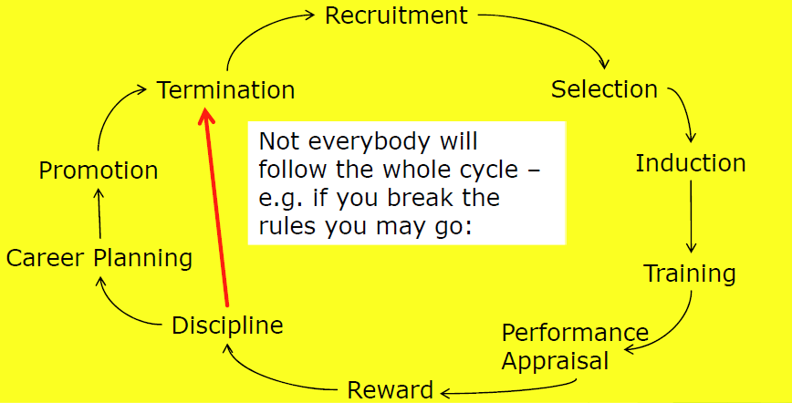

### HRM 发展经历 - 从人事管理到人力资源管理

#### Personnel Management

于 1980 年代出现，至今很多企业也有。

| 定义 | The specialist management function responsible for determining and implementing the policies and procedures which determine the stages of the employment cycle |
| ---- | ------------------------------------------------------------ |
| 翻译 | 专门管理职能，负责确定和实施决定就业周期各阶段的政策和程序   |

During the 1980’s, people began to acknowledge the importance of employees and the concept of human resources, i.e. that they are **assets** of an organisation, was created

在20世纪80年代，人们开始认识到员工的重要性，并创造了人力资源的概念，即他们是组织的**资产**，（所以人事管理变成人力资源管理了）

设立人力部门不仅是作为实际执行部门，也是将员工看作应给予支持、鼓励、保留的观点。整个公司都该这样看。

### HRM 重要性

| 定义 | The HRM function should be included in the organisational strategy The Human Resource Manager or Director is now included in the top level management of an organisation e.g. the Board of Directors |
| ---- | ------------------------------------------------------------ |
| 翻译 | 人力资源管理职能应包括在组织战略中 人力资源经理或总监现在组织的高层管理中，例如董事会等 |

> We may not be able to attract or retain the personnel necessary to achieve our business objectives
>
> 我们可能无法吸引或留住实现我们业务目标所需的人员

### HRM 职能

Employment Cycle 中的每一环都体现 HRM 职能，上面已经体现了。

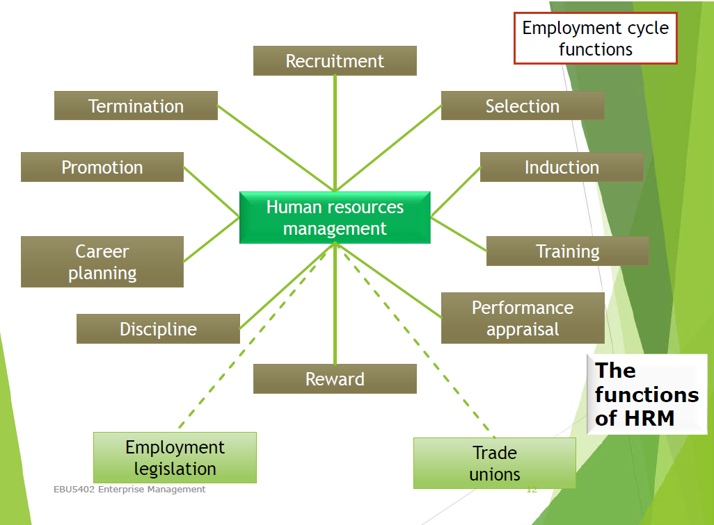

课件中有具体体现的：招聘、选拔、培训和发展、绩效考核、奖励、纪律处分。

#### Recruitment 招聘

打广告招人，需要包含：

- **Job description -** An outline of the role of the job holder
- **Person specification -** An outline of the skills and qualities required of the post holder

#### Selection 选拔

| 定义 | The process of assessing candidates and appointing a post holder |
| ---- | ------------------------------------------------------------ |
| 翻译 | 评估候选人并任命一个职位的过程                               |

方法：面试，心理测试，能力测试，技能练习，展示。

- **Interview -** most common method
- **Psychometric testing -** assessing the personality of the applicants
- **Aptitude testing -** assessing the skills of applicants
- **In-tray exercise -** activity based around what the applicant will be doing, e.g. writing a letter to a disgruntled customer
- **Presentation -** looking for different skills as well as the ideas of the candidate

#### Training & Development 培训和发展

即 Progress opportunities 进步的机会

- **Personal Development -** 培训等，不一定与工作直接相关
- **Continuing Professional Development (CPD)** **继续专业发展 -** 例如专业证书，注册会计师、工程师啥的

#### Performance Appraisal 绩效考核

考核不是简单地给员工的工作表现打分。绩效考核涉及员工和指定的评估师（Appraiser）。**认同**自己的优势、劣势以及帮助员工和组织的方法。可以带来潜能的开发、培训、奖励等。

#### Rewards 奖励

| 定义 | The system of pay and benefits used by the firm to reward and motivate workers |
| ---- | ------------------------------------------------------------ |
| 翻译 | 公司用来**奖励**和**激励**工人的**工资和福利制度**           |

不止包括钱，还包括什么月度最佳员工、假期，员工福利（车子，医保，旅行）啥的都算。

#### Employment legislation 就业法律

英国的一些法案，其他国家也有类似的：

- Employment Act 2002
- Disability Discrimination Act 2005
- Equal Opportunities Act
- Relevant health and safety regulations

#### Discipline 纪律/处分

企业不能动不动就开除人，受就业法案限制。处理工作冲突有如下程序：

很多步骤需要和工会等外部机构合作。

- Informal meetings 非正式会议
- Formal meetings 正式会议
- Verbal warnings 口头警告
- Written warnings 书面警告
- Grievance procedures 申诉

### 人力管理的关键角度

- Leadership
- Motivation
- Communication

### 人际关系软技能/可转移技能

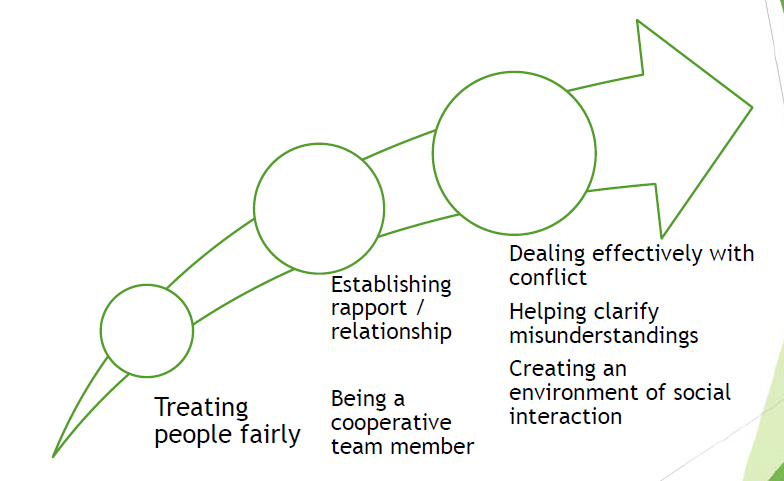

### Leadership 领导力

| 定义 | the process of influencing the activities of an organised group in its efforts toward goal setting and goal achievement |
| ---- | ------------------------------------------------------------ |
| 翻译 | 影响一个有组织**群体**的**活动**，使其努力**建立目标**和**实现目标**的过程 |

良好的领导往往是决定一个组织是否有效和成功的主要因素。

一些成功的领导者：比尔盖茨（Bill Gates）、乔布斯（Steven Jobs）等

### Leadership style 领导风格

三种：Autocratic（独裁）、Participative（参与）、Free-rein（自由）

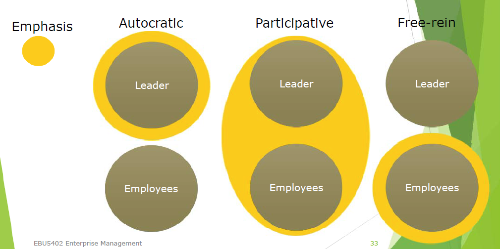

好的领导者会使用这三种风格，在合适的时候使用合适的风格。坏领导者什么时候都只用一种。

#### Autocratic 独裁

- Motivates by threat 用威胁激励人
- No confidence or trust in subordinates 不信任下属
- Imposes decisions, never delegates 强加决策，从不授权
- Makes decisions without consultation 不经讨论就做决定

May be valuable in some types of business where decisions need to be made quickly and decisively. 
This may need to be used – but has to be used carefully

在某些需要快速果断地做出决策的业务类型中可能有价值
可能需要使用，但必须谨慎使用

#### Participative/Democratic 参与/民主

Encourages consultation and communication – e.g. team discussions, ideas boards, etc.
鼓励咨询和沟通，例如团队讨论、创意板等。

Employees can be motivated by their ability to participate in decisions
Decision remains with the leader
员工参与决策的能力会激励他们
决策权掌握在领导者手中

- 有说服力（Persuasive） - 领导者做出决定，并试图说服别人这个决定是正确的
- 协商（Consultative） - 之前有一个协商的过程

#### laissez faire (free rein) 放手/自由

助记：好处是责任共享，激发创意，激励员工，坏处是耽误时间，方向模糊

- the leadership responsibilities are shared by all 领导责任共享

- Can be very useful in businesses where creative ideas are important 在需要创意时很重要
- Can be highly motivational, as people have control over their working life 人们可控制工作，高度激励性

-  Can make coordination and decision making time consuming and lacking in overall direction 导致决策浪费时间，没有整体方向性

### Approaches to Leadership 领导方法

#### Leadership of change 变革的领导力

- The most challenging aspect of business is leading and managing change
  商业中最具挑战性的方面是领导和管理变革

商业环境受到快节奏经济的影响

社会变革受外部和内部因素的双重影响

- Good leaders are aware of potential changes and create solutions or strategies to deal with these changes
- Leaders must manage and ease any transition caused by change
  e.g. restructuring, downsizing (redundancies etc.), growth
- Many of the issues are to do with HRM - i.e. people

- 好的领导者意识到潜在的变化，并创造解决方案或策略来应对这些变化
- 领导者必须管理和缓解任何由变化引起的过渡
- 例如重组、缩减规模(裁员等)、增长
- 许多问题都与人力资源管理有关，即人

#### Trait 特质

| 定义 | The concept that leaders are born as leaders |
| ---- | -------------------------------------------- |
| 翻译 | 领导者天生就是领导者                         |

they possess certain traits that will enable them to become leaders
The theory is that the personality of individuals determines whether they will become leaders or not
Often seen as gender biased – the concept of the“great man theory”

他们拥有使他们成为领导者的**某些特质**
该理论认为，**个人的个性决定了他们是否会成为领导者**
常被视为性别偏见的“伟人论”概念

#### Transformational

| 定义 | a leader who treats relationships with followers in terms of motivation and commitment, influencing and inspiring followers to give more than mechanical compliance and to improve organisational performance |
| ---- | ------------------------------------------------------------ |
| 翻译 | 一位领导者在与追随者的关系中注重**激励和承诺**，通过影响和激发追随者，使其不仅仅是**机械地遵循**，而且提升**组织绩效**。 |

#### behavioural theories 行为理论

- Imply that leaders can be trained 表示领导者可通过培训（取得） – focus on the way of doing things 注重做事的方式
- Structure based behavioural theories 基于结构的行为理论
- focus on the way the leader structures work for subordinates – task orientated 基于任务
- Relationship based behavioural theories 基于关系的行为理论
- focus on the development and maintenance of relationships – process orientated 基于过程

#### conversational 对话

- Focus on reducing negative messages sent out through the everyday actions of the business both externally and, crucially, internally  减少内部（重要）和外部传递的负面信息
- Build relationships and sense of belonging and identity with the organisation 在组织中建立关系、归属感和认同感
- that gets communicated to customers, etc. 传达给客户

#### transactional 事务性

| 定义 | a leader who treats relationships with followers in terms of an exchange, giving followers what they want in return for what the leader desires, following prescribed tasks to pursue established goals |
| ---- | ------------------------------------------------------------ |
| 翻译 | 领导者将与追随者的关系视为一种交换，通过给予追随者他们想要的，以换取领导者所期望的，从而完成既定目标的过程。 |

关注组织管理，关注程序和效率，管理当前问题。

#### contingency 应变

- to be more successful, managers need to use different leadership styles at different times depending on the circumstances 不同时候使用不同的领导风格
- Suggests leadership is not a fixed series of characteristics that can be transposed into different contexts 表示领导力不是固定特征，可以转换

使用何种风格取决于员工类型，业务文化，自然而然等等。

#### Factors affecting leadership style 影响领导力风格的因素

- 风险 - 决策取决于包含的风险
- 业务类型 - 创意型，还是需求驱动
- 变革重要性
- 企业文化 - 长期持有，难以更改
- 任务特性 - 需要合作 指导还是结构等等

## Lecture 17 - Motivation, Business Communication

### 本节结构梳理

此课件分为激励与商务沟通两部分。前半部分给出了激励的定义，为什么要有激励，坏激励的结果，关于激励的两个理论（双因素，马斯洛需求层次），给出了激励的因素和基本元素。后半部分给出了沟通的定义，为什么要沟通，沟通的组成及各个部分的明确内容，随后给出了 9 步高效倾听的方法，给出了阻碍组织沟通的原因。

### Motivation 激励

| 定义 | the cognitive decision-making process through which goaldirected behaviour is initiated, energised and directed and maintained |
| ---- | ------------------------------------------------------------ |
| 翻译 | 认知决策过程，通过其启动、激励、引导和维持目标导向行为的过程。 |

管理者了解激励可影响员工行为

### Poor motivation 坏激励的结果

助记：产品少，产品烂，客户骂，客户走，成本高，员工走，员工骂。

- Lower productivity levels 低生产力
- Poor quality products and services 产品服务质量差
- High levels of complaints from customers 客户投诉
- Loss of customers with subsequently lower revenues 客户流失，收入下降
- Higher costs 高成本
- Higher staff turnover 高员工流失
- Poor industrial relations 劳资关系差

助记：团队停，个人死，文化断，沟通乱

1. Teams may not function appropriately 团队无法正常工作
2. Individuals may be placed in positions that donot maximise or utilise their skills 个人无法最大发挥
3. The culture of the business is not shared 企业文化不流通
4. Communication and decision making can be affected and mistakes occur 影响沟通决策，犯错

都会影响业务和客户的关系。

### Studies and theories on motivation 关于激励的研究和理论

#### Herzberg 的双因素影响理论

- Hygiene factors 保健因素（一般只带来消极情感）
- Motivation factors 激励因素（一般与积极有关，有时也涉及消极情感）

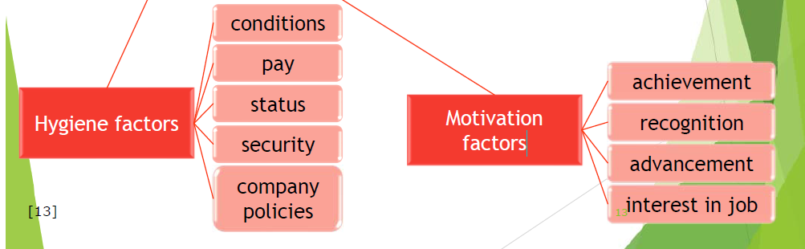

#### Maslow 马斯洛需求层次理论

大多数需求与生理心理生存有关

需求实现从下至上

自我实现的需要是一个健康个体的主要动机，自我实现意味着个体潜能充分发挥，使其成为所能实现的所有。

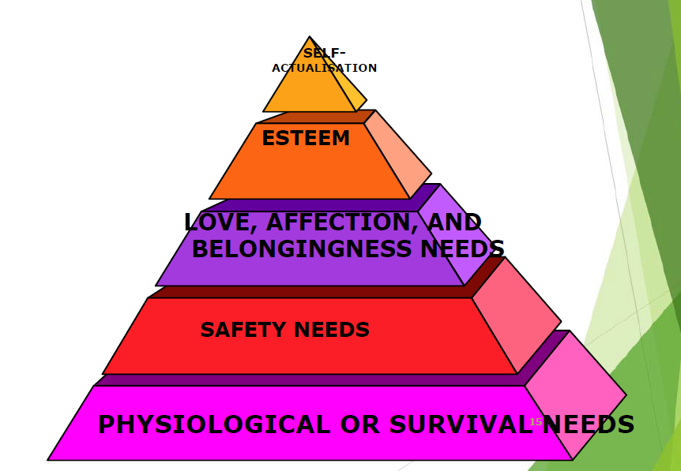

### Motivating Factors 激励因素

助记：尊重我，鼓励我，认可我，工作有挑战性，工作有保障，工作有创意，财务安全

1. Individual respect
2. Challenging work
3. Encouragement from management
4. Financial security
5. Opportunities to express creativity
6. Job security
7. Recognition from others

### Elements of  Work Motivation 工作激励的元素

助记：行为，努力，坚持

- Direction of Behaviour - 选择什么行为
- Level of Effort - 付出多少努力
- Level of Persistence - 遇到困难时，坚持多长时间

### Communication 沟通

| 定义 | The communication process involves the transmission of information and the exchange of meaning between at least two people |
| ---- | ------------------------------------------------------------ |
| 翻译 | 沟通过程包括至少两个人之间信息的传递和意义的交换             |

需要沟通的原因：好沟通能鼓励激励员工，缺少沟通或错误方法消息会导致矛盾，没激励。

### 沟通的组成

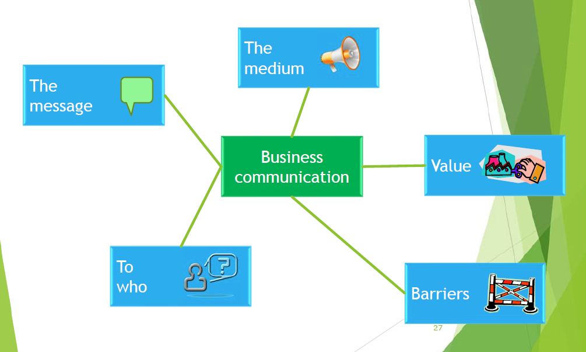

- 媒介：口头，纸，电子，图像和视觉
- 价值：激励，明确管理，反思，协调组织
- 目标：员工，客户，股东，供应商，本地社区
- 消息：目标，意图，类型，是否清晰，重要性
- 阻碍：语言，技术内容，无视反馈，情绪，文化，缺少信任，层次结构

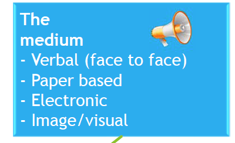

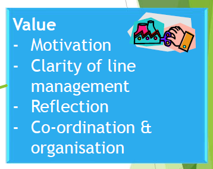

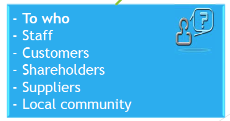

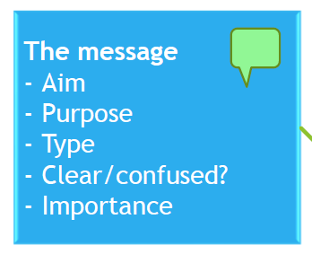

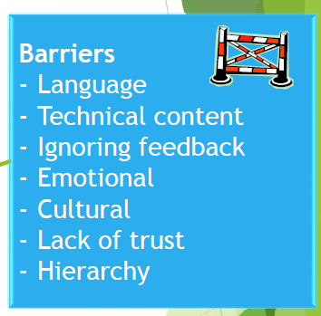

### Nine Steps to Effective Listening 九步高效倾听

助记：我也想编，但是这堆东西太勾史了，凑合着记吧。

1.  Face the speaker and maintain eye contact. 面朝说话者，眼神交互
2.  Be attentive, yet relaxed. 关注且放松
3.  Keep an open mind to the speaker’s message – try to feel what the speaker is feeling. 共感
4.  Listen to the words and try to picture what the speaker is saying. 尝试描绘
5.  Do not interrupt and do not impose your "solutions” 不要打断，不要强加
6.  Wait for the speaker to pause to ask clarifying questions only to ensure understanding of something that has been said (avoiding questions that disrupt the speaker's train of thought) 不要打断思路
7.  Give the speaker regular feedback, e.g. summarize, reflect feelings etc. 要有反馈，例如总结或表示情感等
8.  Pay attention to nonverbal cues -- to feelings, tone of voice, inflection, facial expressions, gestures, posture. 注意非语言交流
9.  Be aware of potential barriers that impact your ability to listen effectively. 要注意到自己也存在障碍

### Barriers to Effective Organisational Communication 组织高效沟通的阻碍

- Organisation Size 组织规模越大越复杂，沟通越难。

助记：位太高，太专业，地理远，层次多

- 高级管理者对员工遥远
- 部门很专业，互相不理解
- 地理距离导致决策者的隔离
- 权力层次复杂，信息传递层次多，可能导致失真或阻断

## Lecture 18 - Corporate Social Responsibility (CSR)

### 本节结构梳理

本节从社会责任讲起，介绍了何为社会责任，为什么要承担社会责任，社会责任包含什么，给出了企业的外部代价和外部获益，给出企业各个利益相关者及各自具体的责任考量，讨论了企业为什么要和不要承担社会责任。随后介绍了公司治理与道德、怎样实现道德，以及绿色消费、环保等概念。

### Corporate Social Responsibility (CSR)  企业社会责任

助记：第一个是对小的（周边的人和社区），第二个是对大的（社会，环境，国际，道德）

| 定义 | A corporation should be held accountable for any of its actions that affect people, their communities and their environment (also known as their stakeholders).  It implies that negative business impacts on people and society should be acknowledged and corrected if at all possible |
| ---- | ------------------------------------------------------------ |
| 翻译 | 一个公司应该对其影响**人们、他们的社区和环境**(也被称为他们的利益相关者)的任何行为负责。这意味着，如果可能的话，应该承认和**纠正**商业对人和社会的**负面**影响 |

| 定义 | The responsibility of an organization for the impacts of its decisions and activities on society and the environment, resulting in ethical behavior and transparency which contributes to sustainable development, including the health and well-being of society;  takes into account the expectations of stakeholders;  complies with current laws and is consistent with international standards of behavior;  and is integrated throughout the organization and implemented in its relations. |
| ---- | ------------------------------------------------------------ |
| 翻译 | 一个组织对其决定和活动对社会和环境的**影响**所承担的责任，从而导致有助于可持续发展，包括社会的**健康和福祉**的**道德行为和透明度**;考虑利益相关者的期望；遵守现行法律，符合**国际行为标准**；并在整个组织中整合并在其关系中实施。 |

### 为什么要承担社会责任

- growing belief amongst many people that organisations have a duty to society greater than simply providing goods and services 人们认为企业有社会责任，不只是提供产品和服务
- Commercial organisations should have a role in society alongside that of non-commercial entities such as the family 商业企业在社会中、非商业实体中也有作用
- Companies that operate in a socially responsible way strengthen their reputations 名誉声誉 决定客户和合作伙伴是否配合，决定在社区中的站位
- CSR goes beyond simple philanthropy and is more about corporate behaviour than it is about a company's charitable donation budget 社会责任不是简单的做慈善，是企业行为（做慈善也很重要）

### 社会责任包含什么

助记：客户，雇员，企业，全部（特殊）群体

- your **goods and services** meet customer requirements, and are provided in a fair way 满足客户需求，平等方式提供
- your **employees** are given responsibility and opportunities to work with the organisation in supporting community projects 雇员有责任支持社区项目
- the organisation is involved in **activities** and programmes that support the development of the **whole community** 公司支持整个社区发展
- you involve **all members** of society by providing them with opportunities rather than marginalising them (e.g. disabled people) 支持全部群体（特殊群体），提供机会，而非边缘化

### Costs and benefits 代价和获益

#### External benefits 外部利益

| 定义 | Benefits that the organisation produces but does not receive any direct income from |
| ---- | ------------------------------------------------------------ |
| 翻译 | 组织产生但不从中获得任何直接收入的利益                       |

例如，给公益捐款，提供市民使用回收设施，摆一个能报时的钟之类的。

#### External costs 外部代价

| 定义 | Costs that are the output of an organisation’s production processes , but the costs are born by stakeholders, not the organisation |
| ---- | ------------------------------------------------------------ |
| 翻译 | 代价是公司生产过程的产物，但代价由利益相关者承担，而不是公司 |

例如排放污染。有些立法要求企业对这些承担更多责任，企业需要把这些变成内部代价，或者减少外部代价。例如，减少排放（可能导致的内部代价就是生产成本增加），或者植树，抵消污染。

### Stakeholders 利益相关者

| 定义 | A person with an interest or concern in something |
| ---- | ------------------------------------------------- |
| 翻译 | 对某事有兴趣或关心的人                            |

例如，公司老板算是利益相关者，公司周边可能受影响的人也是利益相关者。

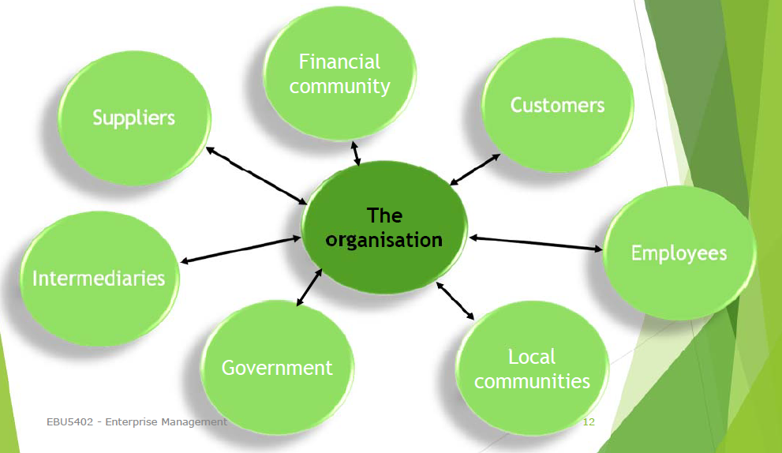

#### Customers 客户

客户想知道产品怎样制作，想知道产品包含什么成分。

负责任的公司不会使用不道德手段吸引潜在用户购买他们不喜欢的产品。例如不需要的昂贵手机号，不经用户同意欺骗其更换到另一公司等。

#### Employees 雇员

1. 社会会把雇员行为上升到公司。
2. 不道德的劳动环境等等，例如侵犯工人权利。

UK’s Best Workplace 2022 (1,000+ employees) [4]

- Salesforce
- CISCO
- Hilton

#### Local communities 本地社区

Many organisations have recognised that having a strong corporate image within their local community is vital for success 许多组织已经认识到，在当地社区拥有强大的企业形象对成功至关重要

市场导向型企业倾向于让自己看起来像好邻居，会办些赞助，慈善，回收啥的。

讨论：是无私风险导致的还是利益导致的。

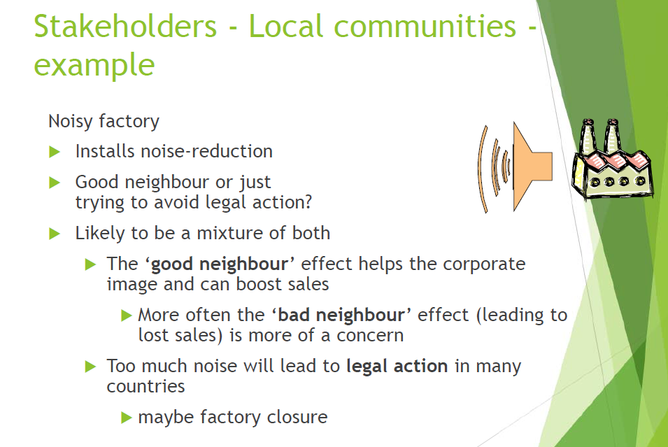

#### Intermediaries 中介

- Wholesalers 批发商
- Retailers 零售商
- Agents/franchisees 经销商

他们和客户、雇员的担心一致，需要考虑他们的担心。例如商业道德可能影响他们。

例子：麦当劳在很多方面被批评，例如产品对健康的影响，怎样对待员工，对环境的影响。在19年被起诉，因为延长工作时间导致工人工作到深夜，伤害工人健康，安全培训不足，母公司对特许公司和员工的责任问题等。

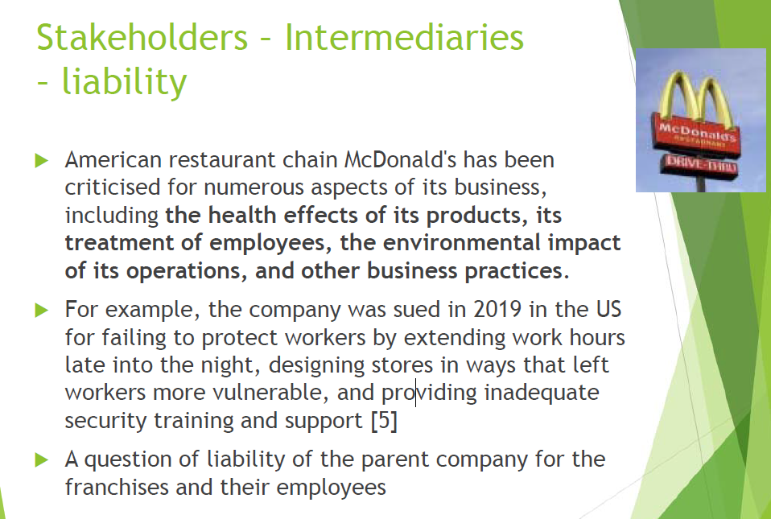

反例：大公司会收到流言干扰。麦当劳曾被错误认为用蚯蚓袋鼠牛眼犰狳肉做汉堡。

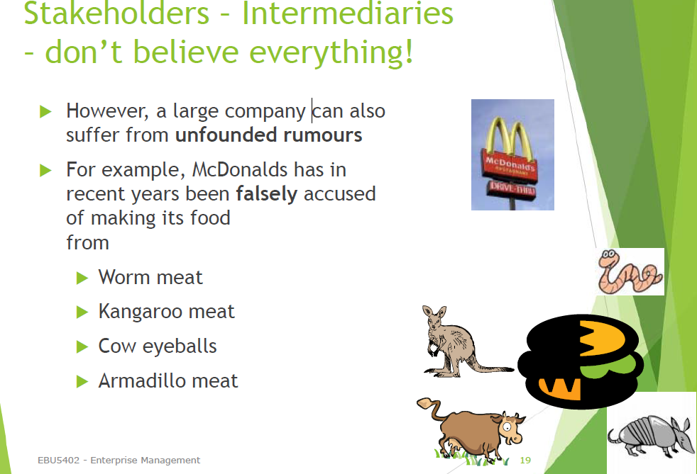

#### Government 政府

政府受社会压力影响，社会受企业外部代价影响。企业需要关注哪些行为是社会不可接受的，考虑是否需要减少，否则可能会被政府规章限制。

快速回应会带来好的印象，我们对大众负责，不用等到政府拿规章来管我们。

#### Suppliers 供应商

好的供应商是成功的关键。

- Taking into account the needs and views of suppliers is a combination of shrewd business sense and good ethical practice
- 好的供应商是成功的关键考虑到供应商的需求和意见是精明的商业意识和良好的道德实践的结合
- 组织还应了解其供应商的做法，以确保他们也符合道德标准
- 供应商的不良做法可能会导致给你的组织带来负面形象 = 失去客户

例子：In 2008, the fashion chain Primark sacked three of its suppliers in India after an investigation for the BBC's Panorama and The Observer uncovered children labouring in Indian refugee camps to produce some of its cheapest garments. The speed at which Primark acted meant that its standing in the high street remained secure at the time, its reputation repaired before many of its customers even noticed it was tarnished [6]

2008年，英国广播公司(BBC)《全景》(Panorama)和《观察家报》(the Observer)的一项调查发现，印度难民营里有童工为Primark生产一些最便宜的服装，随后，时装连锁店Primark解雇了三家印度供应商Primark迅速采取行动，这意味着它在大街上的地位在当时是稳固的，在许多顾客甚至没有注意到它的声誉受损之前，它的声誉就已经恢复了。[6]

**快时尚**：服装需求大，公司为满足快时尚，牺牲质量换取数量，将生产转移到东南亚，出现了低工资，童工，化学品使用，缺少健康和安全保障等等。

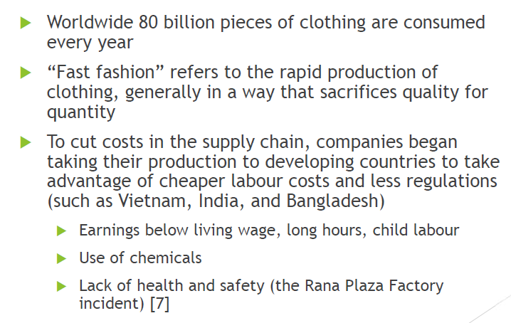

#### Financial community 金融界

包括支持过你的、正在支持你的、未来可能支持你的机构和个人。

金融界不喜欢你，你就拿不到投资。很多大企业花大代价说服投资者，他们是成功的、负责任的公司。

### 为什么企业【要】承担社会责任？

- **Altruistic 利他主义上** - the organisation feels that it has a duty to think about the needs of society not simply the need to make a profit 企业认为有责任满足社会需求，不只是挣钱
- **Pragmatic 务实精神上** - 从社会责任，尤其是环境政策角度上，是增加企业知名度，获取更多收入的机会
- 大多数企业出于以上两种的综合考量

1. 企业社会责任和消费者需求的变化消费者财富的增加，意味着外部利益对消费者来说变得越来越重要
2. 马斯洛的需求层次理论认为，消费者的动机是他们最低层次的未满足需求
3. 当基本需求得到满足时，更高层次的需求会影响他们的购买行为

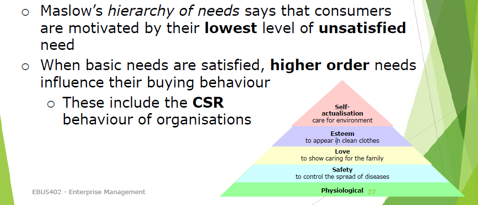

### 为什么企业【不要】承担社会责任？

- There are two main criticisms of CSR
- Philosophical - Companies should concentrate on what they are best at - i.e. making money
- Pragmatic - Critics see CSR as being a form of short-term manipulation of stakeholders by companies

- 对企业社会责任的批评主要有两种
- **哲学上的：**公司应该专注于他们最擅长的事情——即赚钱
- **务实主义上的：**批评人士认为，企业社会责任是企业短期操纵利益相关者的一种形式

The philosophical criticism：公司应该专注于他们最擅长的事情——即赚钱。公司对社会做出贡献的任何尝试都是对其客户征税的一种形式。消费者应该自由地把这笔钱作为“税”花在他们想要支持的东西上，或者政府应该资助所有的社会需求。当企业处于垄断地位，消费者没有选择的时候，这种观点就更为强烈。

The pragmatic criticism：实用主义批评批评者认为，企业社会责任是企业对利益相关者进行短期操纵的一种形式。他们认为企业社会责任是为了提高企业绩效，而不仅仅是为了社会利益。公司只支持“时尚”的事业来提升他们的公众形象，而不一定是最值得的事业。例如支持儿童福利慈善机构却忽视心理健康慈善机构。

其他批评：

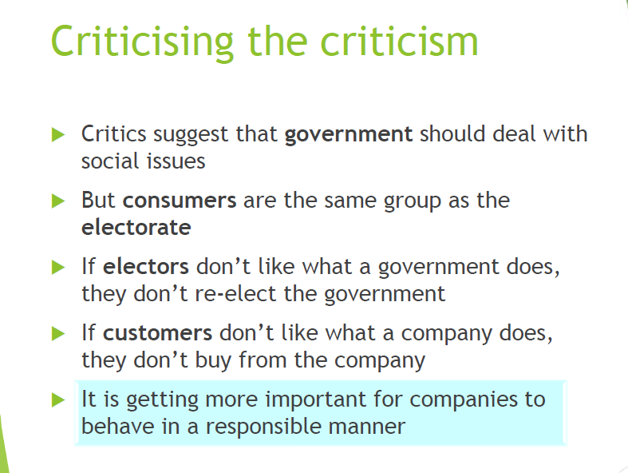

### Corporate Governance 公司治理

| 定义 | ensuring that an organisation is run in a responsible manner with due regard to its stakeholders |
| ---- | ------------------------------------------------------------ |
| 翻译 | 确保组织以负责任的方式运作，充分考虑其利益相关者             |

### 为什么要搞公司治理

1. For many years, companies only had to report basic financial information (e.g. profit & loss)
2. As long as the company apparently made a profit, investors were happy
3. In the late 1990s, there was a series of scandals in which executives badly and fraudulently mismanaged companies
4. The financial detail contained in the standard annual reports was insufficient to protect investors from bad management, so Corporate Governance was establishedEBU5402 - Enterprise Management

多年来，公司只需要报告基本的财务信息(如利润和亏损)。只要公司明显盈利，投资者就会高兴。上世纪90年代末，出现了一系列丑闻，高管们对公司的管理不善，而且存在欺诈行为。标准年度报告中包含的财务细节不足以保护投资者免受管理不善的影响，因此建立了公司治理。

### 公司治理的关键概念

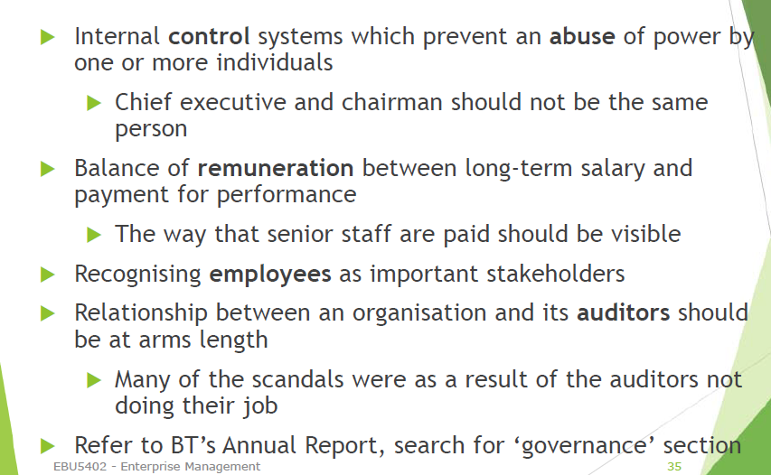

1. 防止一个或多个个人滥用权力的内部控制制度 - 首席执行官和董事长不应该是同一个人
2. 长期工资与绩效报酬之间的差额 - 高级职员的薪酬方式应该是可见的
3. 承认员工是重要的利益相关者
4. 组织与其审计师之间的关系应该保持一定的距离 - 许多丑闻都是审计人员不尽职的结果
5. 参考英国电信的年度报告，搜索“治理”部分

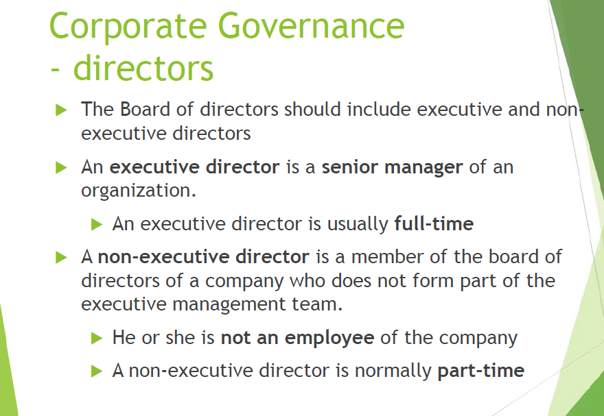

- 董事会应包括执行董事和非执行董事
- 执行董事是一个组织的高级经理 - 执行董事通常是全职的
- 非执行董事是公司董事会的成员，但不构成执行管理团队的一部分 - 不是公司的雇员，非执行董事通常是兼职的

### Ethics vs. Morals

Morals 更指代个人，Ethics 指代其应用到的社会系统。也就是说 Ethics 可以作为全体的行为标准，例如国家道德，社会道德，企业道德，职业道德，家庭道德之类的。

Ethics 与 Legal 区分。例如搞广告吸引小孩劝说父母买自家生产的不健康食物，属于不道德但是不算违法。

### Being ethical

#### premium products 高端产品

以 Ethics 的方式运作会让消费者更愿意购买其产品。例如，消费者更愿意买散养鸡的鸡蛋而不是饲养场的，消费者会为平等交易付钱等等。

#### training staff 员工培训

不 Ethic 的行为会损害商业，所以要培训员工，让他们了解自己该怎么做，什么是 unethical 的行为。

例如，要让员工了解自己正在卖的商品，了解用户需求，把自己卖的产品和用户需求联系起来。

#### rewards 奖励

使用高效的奖励制度可以阻止员工使用 unethical 的方式谋利。例如提成（Commission-based rewards）制度会让员工更倾向于卖贵的而不是最合适的，是个反例。提成是指基本工资低，根据销售额的百分比发提成。

#### technology 技术

新技术带来了新道德问题。例如有的企业在库存里用 RFID 标记货物，卖掉之后有人担心这玩意能追踪隐私。

### Ecological concerns 环境担忧

消费者越来越担心环境。两个主要的点是：全球变换和资源枯竭。通常认为是企业贪婪导致的，事实上消费者贪婪也是个重要因素。

#### global warming 全球变暖

通常认为气温在上升，人类活动导致的。结果可能是海平面上升，极端天气，降水改变，农业受影响。不知道会多严重，工业和消费者应该与此抗争。

#### depletion of resources 资源枯竭

很多资源有限，例如石油和煤炭。一旦用完无法再生。其他很多资源被使用的速度大于再生速度，例如某种鱼。资源在被破坏以获取更有利可图的活动。

### Ecological responsibility 生态责任

商业一般认为与环保相冲突，市场导向的公司不能忽视客户对环境的关切。即公司也应表现出对环保的关切。

### Green consumerism 绿色消费

- The 'green' (i.e. environmentally aware) consumer can provide businesses with opportunities as well as problems
- This 'green' demand can be used in marketing strategies e.g. promotion
- But, this needs to be backed by environmentally sound products and services
- Going 'green' can save money
- Obtaining goods from local suppliers cuts costs in the distribution channel
- Using recyclable shipping materials may cut costs

- 绿色”(即有环保意识的)消费者可以为企业提供机会，也可以为企业带来问题
- 这种“绿色”需求可以用于营销策略 - 例如促销 - 但是，这需要以无害环境的产品和服务为后盾
- “绿色环保”可以省钱 - 从当地供应商那里获取货物可以降低分销渠道的成本，使用可回收的运输材料可以降低成本
- Legislation on environmentally sensitive practices has led to increased costs for organisations.Those organisations who acted ahead of the legislation have gained experience and competitive advantage
- 对环境敏感的做法的立法导致机构的成本增加。
- 那些在立法之前采取行动的组织已经获得了经验和竞争优势

