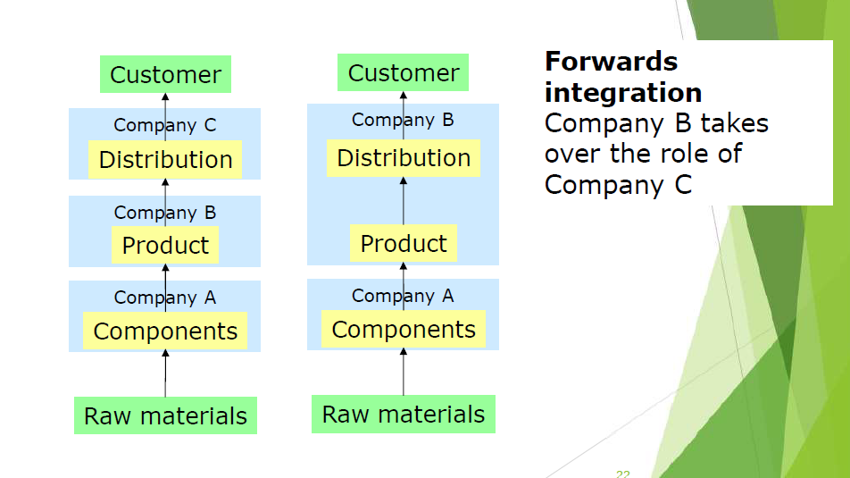

## 说明

第二题范围为课件 Lecture 5 - Lecture 8，共四节。本题总分 30 分，分为 Part A 和 Part B 两部分，Part A 为简要描述题，需要简要描述给出的概念，并需要给出一些例子。Part B 为讨论/描述题。

- **Describe: Give a clear description that includes all the relevant features - think of it as 'paintings a picture with words'**
- 描述：给出一个清晰的描述，包括所有相关的特征，把它想象成“用文字画一幅画”。
- **Discuss: Examine, analyse carefully, and present considerations pro and con regarding the problems, or items involved; give a complete and detailed answer.**
- 讨论：仔细检查、分析，并就所涉及的问题或项目提出赞成和反对的考虑；给出一个完整而详细的答案。

**Lecture 5 介绍了宏观经济，具体话题为：**

- 经济衡量指标，经济结构，收入流动，商业周期

**Lecture 6 及 7 介绍了商业战略，具体话题为：**

- 战略，战略分析及工具，战略类型，波特五力

**Lecture 8 介绍了市场营销，具体话题为：**

- 营销的概念，营销组合，市场识别，市场细分

## Lecture 5 – Macroeconomics

### 本节结构梳理

本节介绍了衡量经济的指标（GDP），介绍了收入流动及乘数效应、加速器效应、通胀的概念，简单介绍了商业周期和其他衡量经济的指标。

- **Macroconomics** deals with the way the economy works at international or national level
- **宏观经济学**研究的是**国际或国家层面**的**经济运行方式**
- Microeconomics deals with individual organisations and their customers and suppliers
- 微观经济学研究的是**个体组织及其客户和供应商**

### Macroeconomics 宏观经济学

| 定义 | the branch of economics that studies economic aggregates (grand totals) e.g. the level of prices, output and employment in the economy |
| ---- | ------------------------------------------------------------ |
| 翻译 | 经济学中研究经济总量的一个分支，如经济中的价格、产出和就业水平。 |

宏观经济学关注的是整个经济。本节聚焦国家层面。

- Aggregate demand 总需求 - the total level of spending in the economy 经济中总支出水平
- Aggregate supply 总供给 - the total amount of output in the economy 经济中的总产出

### The structure of the national economy 国民经济结构

- **Primary 第一产业 -** the production and extraction of natural resources e.g. mining and from agriculture 自然资源的生产和提取
- **Secondary 第二产业 -** output of the manufacturing and construction sectors (e.g. phone makers) 制造和建造业
- **Tertiary (Services) 第三产业/服务业 -** production of services; includes finance, leisure, retail, communications and transport 服务产业，金融，休闲等

### Measures of economic structure 衡量

- 在 GDP 中的占比
- 雇佣的劳动力占比
- 对国家国际收支的贡献

| 定义 | Balance of payments - "a record of all transactions between domestic consumers and firms and those based overseas" |
| ---- | ------------------------------------------------------------ |
| 翻译 | 国际收支——“国内消费者和公司与海外公司之间所有交易的记录”     |

### Circular flow of income 收入循环流动

| 定义 | the means by which money circulates in an economy between households and firms |
| ---- | ------------------------------------------------------------ |
| 翻译 | 货币在家庭和企业间流动的方式                                 |

The level of wealth within an economy is influenced by the interactions between households, firms and government 一个经济体的财富水平受到家庭、企业和政府之间相互作用的影响

It follows that any change in income from employment is directly related to changes in expenditure by consumers. 就业收入的任何变化都与消费者支出的变化直接相关。

#### Phillips machine model of the economy
The Phillips Machine is actually a physical hydraulic computer that can predict the running of the national economy to within 4% accuracy. 菲利普斯机实际上是一台物理液压计算机，它可以预测国民经济的运行，精度在4%以内。

### Multiplier effect 乘数效应

| 定义 | the addition to total income and expenditure within an economy resulting from an initial injection of expenditure |
| ---- | ------------------------------------------------------------ |
| 翻译 | 在一个经济体中，由于最初的支出注入而增加的总收入和总支出     |

注入资金影响收入循环流动，首先影响家庭和企业，经济的其他部分随后受间接影响。

### Accelerator effect 加速器效应

| 定义 | When a small change in demand has a much larger effect on investment or supply |
| ---- | ------------------------------------------------------------ |
| 翻译 | 当需求的微小变化会对投资或供给产生大得多的影响时             |

投资水平取决于国民收入或需求的变化率 因为它取决于变化率，可能会有很大的波动

### Inflation 通货膨胀

| 定义 | a rise in the general level of prices of services and goods |
| ---- | ----------------------------------------------------------- |
| 翻译 | 服务和商品价格总水平的上升                                  |

同样的钱买到更少商品。

- **demand-pull inflation** - 钱进入市场->乘数效应->需求增加->需求拉动型通胀
- **cost-push inflation** - 产品原料涨价->产品价格升高->成本推动型通胀

通胀恶性循环：

### Business cycle 商业周期

国家经济很少保持稳定。

- 撤资导致经济下降，注资导致经济上升
- 商业周期描述了经济活动的波动
- 衰退还是繁荣，扩张还是紧缩，发展还是萧条

### Other indicators 其他指标

- Unemployment rates 失业率
- Output levels 产出水平
- Average earnings 平均收入
- Disposable income 可支配收入
- Consumer spending 消费者支出
- Inflation rate 通胀率
- Interest rates 利率
- Overseas trade figures 海外贸易
- Exchange rates 汇率

## Lecture 6 - Strategic Analysis

### Two levels of strategies

- **Corporate-level** - 企业应当做什么业务，公司的文化和领导结构（在公司合并时很重要）
- **Business-level** - 竞争，价值产生，持续竞争优势

### Corporate strategy 企业战略

| 定义 | Identification of the purpose of the organisation and the plans and actions to achieve that purpose |
| ---- | ------------------------------------------------------------ |
| 翻译 | 确定组织的**目的**，以及实现该目的的**计划和行动**           |

索尼的例子：

Sony continues to prioritize management with a long-term view, and defines its purpose as to "fill the world with emotion through the power of creativity and technology," and its management direction as "getting closer to people." 索尼一直以长远的眼光来优先考虑管理，并将其目标定义为“通过创造力和技术的力量让世界充满情感”，将其经营方向定义为“更接近人”。

President and CEO Kenichiro Yoshida explained that people are at the core of the Sony Group's business portfolio, outlined actions to strengthen Group management, and laid out the direction of the evolution of each business. 总裁兼首席执行官吉田健一郎解释说，人是索尼集团业务组合的核心，概述了加强集团管理的行动，并制定了每项业务的发展方向。

**Most organisations begin the strategy formulation process by creating a Mission statement and a Vision statement 大多数组织通过创建使命声明和愿景声明开始战略制定过程**：

- **Mission Statement** - 我们的业务是什么，没有时间线，如果没有重大变更可以持续很久
- **Vision Statement** - 我们想成为什么，与目标和未来更相关，通常和成功后的成就相关联

### Business Strategy 业务战略

- 公司战略涉及整个组织集团层面部门级别
- 商业策略专注于特定的业务、子公司或运营单位
  - 包括仔细考虑它的目的、资源以及它如何与它所处的环境相互作用。

商业战略是实现长期目标的一种手段商业战略。有时被称为“业务单位战略”或“职能战略”。包括：

- marketing strategies 市场
- new product development strategies 新产品开发
- human resource strategies 人力
- financial strategies 财务
- legal strategies 法律
- supply-chain strategies 供应链
- information technology management strategies IT管理

一些例子：

- Geographic expansion 地理扩张
- Diversification 多样化发展
- Merger & Acquisition 并购
- Market penetration 市场渗透
- Retrenchment 裁员
- Liquidation 清算
- Joint venture 合资

### Strategic analysis approaches

- **rational approach 理性分析** - 把战略看作科学合理的过程，使用 SWOT、PESTEL 等技术，主要目标是使利益最大化
- **flexible approach 灵活分析** - 环境多变复杂的时候，用 SWOT 之类的工具困难且不合理。利益最大化不一定是最优解，环境多变，历史数据可能无关紧要。有一种方法是场景分析，设想若干场景，为每种可能准备应急方案。创业公司喜欢用这种法子，比较灵活。
- **creative approach 创意分析 **- 强调想象力，将灵活分析更进一步。取决于管理者想象力创造力。环境变化后，理性分析和灵活分析可能落后。
- **behavioural approach 行为分析** - 战略本身不是理性过程。可能与利益相关者出现冲突，多方主导者的行为可能影响公司战略。可能影响 SWOT 分析的开展。创业公司常用。
- **incremental approach 渐进分析** - 长期战略规划不明确，管理者会逐渐适应公司，战略会随外部环境变化，渐进分析提供了明确有效的方法。

### lack of strategy

- 没有战略，被动管理，易出现危机（救火）

### PESTEL 分析 （前面讲过）

### SWOT 分析

SWOT 即 Strengths, Weaknesses, Opportunities, Threats.

- **Strengths -** 内部，专业营销知识，新产品，业务地点，业务流程质量，任何对业务产品/服务有利的方面。
- **Weaknesses -** 内部，缺少营销知识，同质化的产品，业务地点很烂，产品服务质量差。
- **Opportunities -** 外部，发展中的市场，合并 合资 联盟，进入新细分市场，国际市场，竞争者退出。
- **Threats -** 外部，新竞争者，和竞争者打价格战，竞争者有新创新产品，竞争者有牛逼进货渠道，你的产品和服务收大税。

这里 ppt 给了一个对沃尔玛做 SWOT 分析的例子，建议看下，在 ppt 的 35 页开始。

## Lecture 7 - Strategic Planning

战略分析用于确定现在业务情况如何，战略规划用于研究未来 5-10 年业务如何。

### Strategic Planning 战略规划

Strategic planning is usually the responsibility of top-level executives at corporate headquarters and senior managers at domestic or foreign subsidiaries 战略规划通常是公司总部的高层管理人员和国内外子公司的高级管理人员的责任。

- **Strategic Objectives**: clear statement of objectives is needed and a vision of the future direction of the organisation is required. 战略目标:需要明确的目标陈述，并且需要对组织的未来方向有一个愿景。
- **Strategic Definition**: strategy development can be broken down into formulation of different strategic options and then selection. 战略定义:战略发展可以分解为制定不同的战略，然后进行选择。
- **Strategic Implementation**: After strategy development, enactment of the strategy occurs as strategy implementation 战略实施:战略制定后实施

### Key Factors in Strategic Planning 关键因素

- Competitive Advantage 竞争优势
- Adding Value 附加价值
- Mass markets or niche markets 大市场或利基市场（缝隙市场的意思）
- Cost based strategies 基于成本的战略
- Market based strategies 基于市场的战略

### Types of strategic planning 类型

- **Growth Plans** - 发展计划，有些大公司以及发展到了很难知道未来怎么发展的情况了。需要非常创新型的思维。
- **Contingency Plans** - 应急计划，若事情没有按计划发展的计划。

- **outward looking** 向外看
- **inward looking** 向内看

### outward looking 外向型战略

- **Competitive Advantage 竞争优势** 成本优势/价格领导力
- **New product development 新产品开发 **领先竞争对手
- **Contraction/Expansion 收缩/扩张 **专注于自己的核心竞争力，还是扩展到更大市场
- **Global 全球化** 寻求扩大全球业务

### inward looking 内向型战略

- **Downsizing 减小规模** 裁剪/卖掉不需要的业务
- **Delayering 减小层级 **扁平化管理结构，加速决策
- **Restructuring 重构** 完全重新思考业务模式
- **Reengineering 重工程化 **looking at new and innovative ways of doing things to leverage the organisation's performance 寻找新的和创新的做事方式，以利用组织的绩效

### Porter’s 5-force model 波特五力模型

Before any company plans to expand into new markets, divests product lines, acquires new businesses, or sells divisions, it should ask itself, ‘Is the industry/market exciting/attractive?’任何公司在计划开拓新市场、剥离产品线、收购新业务或出售部门之前，都应该问问自己:“这个行业/市场是否令人兴奋/有吸引力?”

迈克尔·波特(Michael Porter)在1980年开发了一个分析行业内竞争的框架

By using this analysis technique, managers can develop their competitive strategy 通过使用这种分析技术，管理者可以制定他们的竞争战略。这种分析的结果有助于管理者意识到机会并克服威胁

使用四种力量，分析其合在一起后如何影响市场。关注服务客户和赚取利润的能力，五种力量决定了该公司对市场的吸引力。任何一种力量的变化都应当重新评估市场。

#### Threat of potential entrants 潜在进入者的威胁

主要受进入壁垒的影响：品牌忠诚度，进入成本（如人员再培训），资本要求，分销渠道，经验曲线/学习曲线，可预期的报复，政府政策等等。可通过预期市场发展、预期利润抵消。

#### Bargaining power of suppliers 供应商议价能力
受如下因素影响：供应商数量，供应商的客户数量，数量的重要性，投入差异化程度，替代供应的可行性，更换供应商的成本（例如专业设备），企业和供应商的垂直整合能力威胁，相对于销售价格的成本。

**垂直整合（Vertical integration）**：例如公司A生产组件，公司B生产产品，公司C负责分销；公司B自己开始生产组件了，这叫后向整合（Backwards integration）；公司B自己开始分销了，这叫前向整合（Forwards integration）；公司B把组件产品分销全包了，这叫全部整合（Full integration）。

#### Bargaining power of buyers 买家议价能力

受以下因素影响： 有多少客户，客户可选的供应商数量，产品分化性，已有和预期的替代产品，买家数量，买家更换供应的成本，后向整合能力，买家对价格的敏感性。

#### Threat of substitutes 替代品的威胁

替代品不一定是相同产品，能满足需求的产品都算（例如俩航空公司打架，结果开火车的给他们客户抢走完了）。受以下因素影响：买家替代的意愿，替代的相关价格，更换的成本，替代品的可用性，perceived level of product differentiation/quality 产品差异化/质量的感知水平

#### Degree of rivalry 竞争程度

四力合一。

### Limitations of Porter’s 5-force model 局限性

- It assumes relatively static market structures based originally on the economic situation in the eighties 基于80年代初的经济状况 假设市场结构还是静态的
- Does not take into account new business models and the dynamism of the industries 没有考虑到新的商业模式和行业的活力
- For example, technological innovations and dynamic market entrants from start-ups that will completely change business models within short times. 例如，技术创新和来自初创企业的充满活力的市场进入者将在短时间内彻底改变商业模式。
- For instance, the computer and software industry is often considered as being highly competitive. 例如，计算机和软件行业通常被认为是竞争激烈的行业。

## Lecture 8 – Marketing

### Marketing 市场营销

| 定义 | Marketing is the social and managerial process by which individuals and groups obtain what they need and want through creating and exchanging products and values with others. |
| ---- | ------------------------------------------------------------ |
| 翻译 | 市场营销是**个人和团体**通过**创造**和与他人**交换产品和价值**来获得他们**需要和想要**的东西的社会和管理过程 |

### The Marketing Concept 营销的概念

#### Needs, wants & demands

**Human need**

| 定义 | a state of deprivation that you feel |
| ---- | ------------------------------------ |
| 翻译 | 感受到的一种被剥夺的状态             |

**Human want**

| 定义 | tthe form that a human need takes as shaped by culture and individual personality |
| ---- | ------------------------------------------------------------ |
| 翻译 | Human want 的形式是由文化和个人个性所塑造的                  |

**Demands**

| 定义 | human wants that are backed by buying power |
| ---- | ------------------------------------------- |
| 翻译 | 由购买力支持的 human want                   |

#### Products and services 产品与服务

**Product**

| 定义 | anything that can be offered to a market for attention, acquisition, use or consumption that might satisfy a want or need |
| ---- | ------------------------------------------------------------ |
| 翻译 | 任何可以提供给市场以引起注意、获取、使用或消费的东西，可以满足某种欲望或需求 |

**Services**

| 定义 | activities, benefits or satisfactions that are offered for salle Services are products that consist of activities, benefits or satisfactions that are offered for sale and are essentially intangible |
| ---- | ------------------------------------------------------------ |
| 翻译 | 供出售的活动、利益或满意程度 服务是由供销售的活动、利益或满足组成的产品，本质上是无形的 |

#### Value, satisfaction and quality

**Customer value**

| 定义 | the consumer's assessment of the product's overall capacity to satisfy his or her needs |
| ---- | ------------------------------------------------------------ |
| 翻译 | 消费者对产品满足其需求的总体能力的评估                       |

**Customer satisfaction**

| 定义 | the extent to which a product's perceived performance matches a buyer's expectations |
| ---- | ------------------------------------------------------------ |
| 翻译 | 产品的感知性能与购买者期望相匹配的程度                       |

产品性能高于顾客预期，顾客高兴，低于顾客预期，顾客伤心

#### Exchange, transactions and relationships

**Exchange**

| 定义 | the act of obtaining a desired object from someone by offering something in return |
| ---- | ------------------------------------------------------------ |
| 翻译 | 通过提供某种东西作为回报而从某人那里得到想要的东西的行为     |

**Transaction**

| 定义 | a trade between two parties that involves at least two things of value, agreed-upon conditions, a time of agreement and a place of agreement |
| ---- | ------------------------------------------------------------ |
| 翻译 | 交易双方之间至少涉及两种有价值的东西、约定的条件、约定的时间和约定的地点的交易 |

**Relationship marketing**

| 定义 | the process of creating, maintaining and enhancing strong, value-laden relationships with customers and other stakeholders. |
| ---- | ------------------------------------------------------------ |
| 翻译 | 与客户和其他利益相关者建立、维护和加强强有力的、充满价值的关系的过程。 |

#### Market

| 定义 | the set of all actual and potential buyers of a product or service |
| ---- | ------------------------------------------------------------ |
| 翻译 | 一种产品或服务的所有实际的和潜在的购买者                     |

### Marketing Mix 营销组合

| 定义 | the set of controllable tactical marketing tools product, price, place and promotion - that the firm blends fo produce the response it wants in the target market |
| ---- | ------------------------------------------------------------ |
| 翻译 | 一套可控的战术营销工具——产品、价格、地点和促销——企业将其混合在一起，以在目标市场产生它想要的反应。 |

也称作 4 'P's：Product、Promotion、Price、Place。又补充了 3 个：People、Process、Physical Environment

数字时代的新 4P：Personalization、Participation、Peer2Peer、Predictive modelling

#### Product differentiation

**Core Product**

| 定义 | the problem-solving services or core benefits that consumers are really buying when they obtain a product |
| ---- | ------------------------------------------------------------ |
| 翻译 | 消费者在购买产品时真正购买的解决问题的服务或核心利益         |

**Actual Product**

| 定义 | a product's parts, quality level, features, design, brand name, packaging and other attributes that combine to deliver core product benefits |
| ---- | ------------------------------------------------------------ |
| 翻译 | 产品的部件、质量水平、功能、设计、品牌名称、包装和其他属性结合起来，传递核心产品的好处。 |

**Augmented product**

| 定义 | additional consumer services and benefits built around the core and actual products |
| ---- | ------------------------------------------------------------ |
| 翻译 | 围绕核心产品和实际产品建立的额外消费者服务和利益             |

例如，买宽带送免费安装

**Potential product**

| 定义 | Potential product - includes all of the features and services that could be envisaged as beneficial to customers, i.e. what can be used to differentiate the product next? |
| ---- | ------------------------------------------------------------ |
| 翻译 | 潜在产品——包括所有可能对客户有益的功能和服务，也就是说，接下来可以用什么来区分产品? |

#### Product Classification

- **Consumer product** - 买来自己消费
  - **Non-durable product** - 不耐用品。用几次就寄了，食品、消耗品等
  - **Durable product** - 耐用品，家具啥的
- **Convenience product** - 便利产品，常用，不是很乐意比价，牙膏杂志之类的
- **Shopping product** - 购物产品，很乐意比价，电视啥的
- **Speciality product** - 特色产品，有独特价值，类似劳力士手表
- **Unsought product** - 不需要的产品，比如人寿保险
- **Industrial product** - 工业产品，个人/机构买来进一步加工的产品。例如电脑芯片

### Branding 品牌

| 定义 | a name, term, sign, symbol or design, or a combination of these, intended to identify the goods or services of one seller or group of sellers and to differentiate them from those of competitors |
| ---- | ------------------------------------------------------------ |
| 翻译 | 一个名称、术语、标志、符号或设计，或这些的组合，旨在识别一个或一组销售者的商品或服务，并将其与竞争对手的商品或服务区分开来。 |

### Promotion 推销/促销

| 定义 | Activities that communicate the product or service and its merits to target customers and persuade them to buy |
| ---- | ------------------------------------------------------------ |
| 翻译 | 向目标顾客宣传产品或服务及其优点并说服他们购买的活动         |

| 定义 | Promotion Mix - The specific mix of advertising, personal selling, sales promotion and public relations that a company uses to pursue its advertising and marketing objectives |
| ---- | ------------------------------------------------------------ |
| 翻译 | 促销组合 - 公司为实现其广告和营销目标而使用的广告、个人销售、促销和公共关系的具体组合。 |

#### Promotion tools 促销工具

- Advertising 广告
- Personal selling 个人销售
- Sales promotion 促销活动
- Public relations 公共关系
- Direct marketing 直接营销

### Price 价格

| 定义 | the amount of money charged for a product or service, or the sum of the values that consumers exchange for the benefits of having or using the product or service |
| ---- | ------------------------------------------------------------ |
| 翻译 | 为某种产品或服务收取的费用，或消费者为获得或使用该产品或服务的利益而交换的价值总和。 |

影响价格的因素

常见的定价方法：

- 基于成本 - 制作产品花多少钱
- 基于价值 - 顾客认为值多少钱
- 基于竞争 - 动态定价，看其他人（竞争对手）卖多少钱

### Place

| 定义 | all the company activities that make the product or service available to target customers |
| ---- | ------------------------------------------------------------ |
| 翻译 | 为目标客户提供产品或服务的所有公司活动                       |

### Identifying your target market 确定目标市场

首先需要进行市场切分。一些术语：

### Market segmentation

| 定义 | dividing a market into distinct groups of buyers with different needs, characteristics or behaviour, who might require separate products or marketing mixes |
| ---- | ------------------------------------------------------------ |
| 翻译 | 将市场划分为具有不同需求、特征或行为的不同买家群体，他们可能需要不同的产品或营销组合。 |

- Mass marketing - 大众市场
- Segmented markets - 分割市场
- Niche marketing - 利基市场（这是个术语）
- Micromarketing - 微市场

#### Mass marketing - 大众市场

| 定义 | using almost the same product, promotion and distribution for all consumers |
| ---- | ------------------------------------------------------------ |
| 翻译 | 对所有消费者使用几乎相同的产品、促销和分销                   |

例如福特车一开始都是黑的。好处是可能可以面向更广大的市场，缺点是不同的客户希望产品能满足更小的需求。

#### Segmented markets - 分割市场

| 定义 | adapting a company's offerings so they more closely match the needs of one or more segments |
| ---- | ------------------------------------------------------------ |
| 翻译 | 调整公司的产品，使其更符合一个或多个细分市场的需求。         |

认识到顾客有不同的需求、观念和购买行为。例如，商业/私人合同和“随用随付”移动电话市场细分。

- 好处：市场营销更有效率，通信是面向特定客户的，这将带来更高的营销投资回报
- 坏处：可能会导致竞争水平降低，因为每个公司可能会确定一个重点细分市场

#### Niche marketing - 利基市场

| 定义 | adapting a company's offerings to more closely match the needs of one or more subsegments where there is often little competition |
| ---- | ------------------------------------------------------------ |
| 翻译 | 调整公司的产品以更紧密地满足一个或多个细分市场的需求，这些细分市场通常很少有竞争。 |

- 利基市场营销人员必须真正了解他们的消费者的需求，这样他们才愿意为他们的产品支付额外的费用。
- 利基市场允许小公司通过将资源集中在这些利基市场来竞争，这些利基市场可能是大公司所忽视的领域

#### Micromarketing - 微市场

| 定义 | a form of target marketing in which companies tailor their marketing programmes to the needs and wants of narrowly defined geographic, demographic, psychographic or behavioural segments |
| ---- | ------------------------------------------------------------ |
| 翻译 | 一种目标营销的形式，在这种形式中，公司根据狭窄定义的地理、人口、心理或行为细分市场的需要和需求定制营销计划。 |

分两种：

- Local marketing - 定制满足当地特殊群体要求
- Individual marketing - 定制，满足个人客户需求，比如定制衣服，定制假期旅行啥的。

### 细分市场的其他方法（变量）

- Geographic segmentation
- Demographic segmentation
- Psychographic segmentation
- Behavioural segmentation

