## 本章

分两个主要部分：实用AI工具和计算机视觉。前一部分介绍一些框架和工具，内容不多，后一部分介绍计算机视觉，占大头。

此文档整理总结Week3 Slide中的定义和知识点。

## 所有知识点

按PPT内顺序排列。列出PPT和tutorial中所有概念的英文原始释义（若有）和中文翻译，方便背诵。

***

###  scikit-learn

PPT p5-p13

> **\[Simple and efficient tools for predictive data analysis]**
> 用于预测数据分析的简单有效的工具

开源免费可商用的数据分析工具，对所有人可用，不限制训练框架（Tensorflow. Pytorch等），支持机器学习方法，数据处理，可视化，基于Numpy、SciPy、matplotlib等库。

提供分类Classification、回归Regression、聚类Clustering等工具。课件中给出了一些实际的例子。

***

###  Tensor张量

PPT p14-p14&#x20;

> **\[In deep learning frameworks, they use specialized data structure called Tensor.]**
> 在深度学习框架中，使用称为张量的专用数据结构。

张量的本质是多维数组（Multidimensional Array）。例如，0阶张量的本质是一个实数或复数，一阶张量是一个矢量，二阶张量是一个矩阵，更高阶数的张量类似，例如三阶张量表示立方体中的数等等。

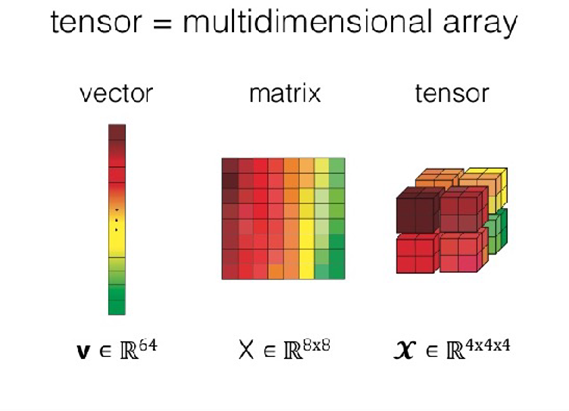

***

###  GPU与深度学习

PPT p16

> **\[Deep learning relies on GPUs.]**
> 深度学习依赖于GPU

严格来说这说法不准确，深度学习依赖密集计算，只不过是跟CPU一比GPU刚好能干这活。GPU毕竟还是专搞图形计算的。

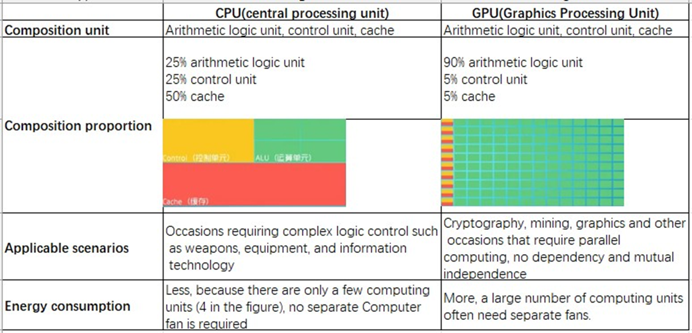

CPU适用于复杂逻辑控制，例如武器装备，IT等场景；GPU适用于密码学、挖矿、图形计算等需要平行计算的场景。CPU耗能小，GPU耗能高。

***

###  TensorFlow

PPT p17-p14&#x20;

> **\[An open-source Deep Learning library]**
> 一款开源的深度学习库

由谷歌贡献。其训练流程：

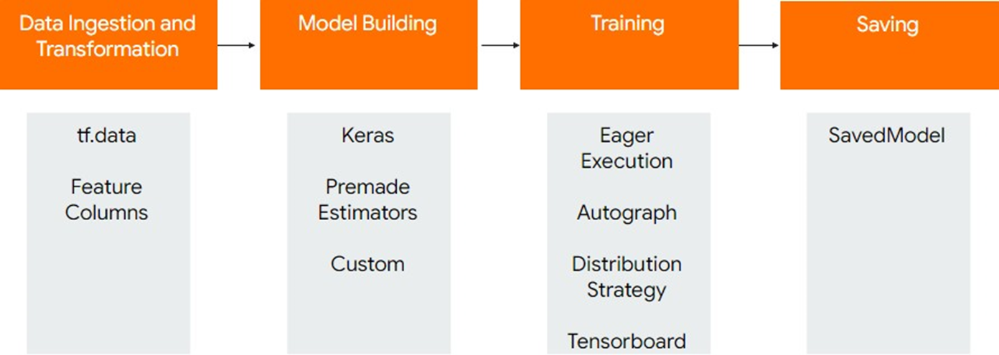

其编程模型可将数字计算（Numeric Computation）过程表达为图表。图表节点为带有数字输入输出的操作，图表的边缘为节点间流动着的张量。

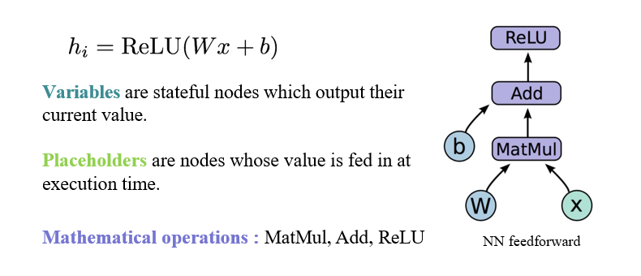

***

###  Static Graph & Dynamic Graph

PPT p20
Tutorial Solution Q1

> **\[The computation process can be view as a graph.]**
> 计算过程可展示为图表

> A static graph is one that defines the entire computation graph before performing the computation. When the data is obtained, it is calculated according to the defined calculation graph.
> 静态图是在执行计算之前定义整个计算图的图。获得数据后，根据定义的计算图进行计算。

> Dynamic graphs, on the other hand, generate computational graphs as they are computed, and the complete graph is known only when the computation is completed.
> 动态图在计算时生成计算图，并且只有在计算完成时才能得到完整的图表。

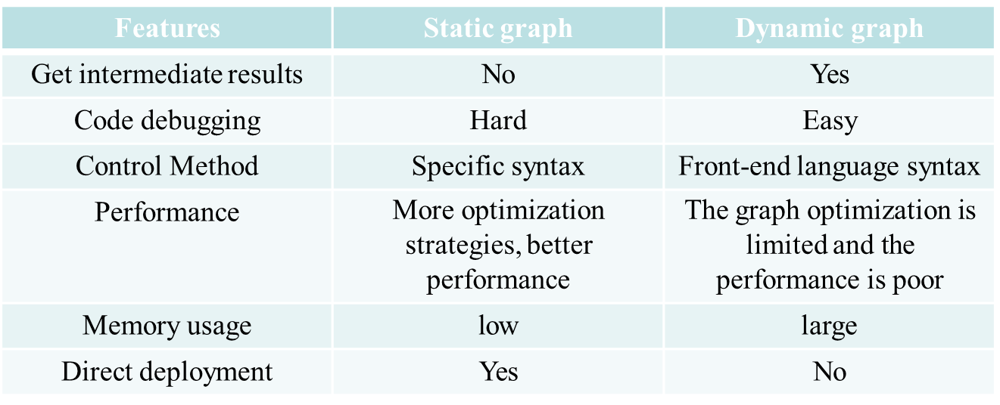

***

###  PyTorch

PPT p-p&#x20;

> **\[Open-source machine learning library]**
> 开源的机器学习库

由Fackbook AI研究实验室维护，依靠GPU能力，自动计算梯度，更容易测试和开发新产品。

优点有：类Python（Pythonic）设计理念，简洁；自动计算梯度（Autograd）；有许多已实现好的算法和组件。

***

###  STAR-Lab

PPT p25

> QMUL软广时间，略

***

###  Brief History of Computer Vision

PPT p31

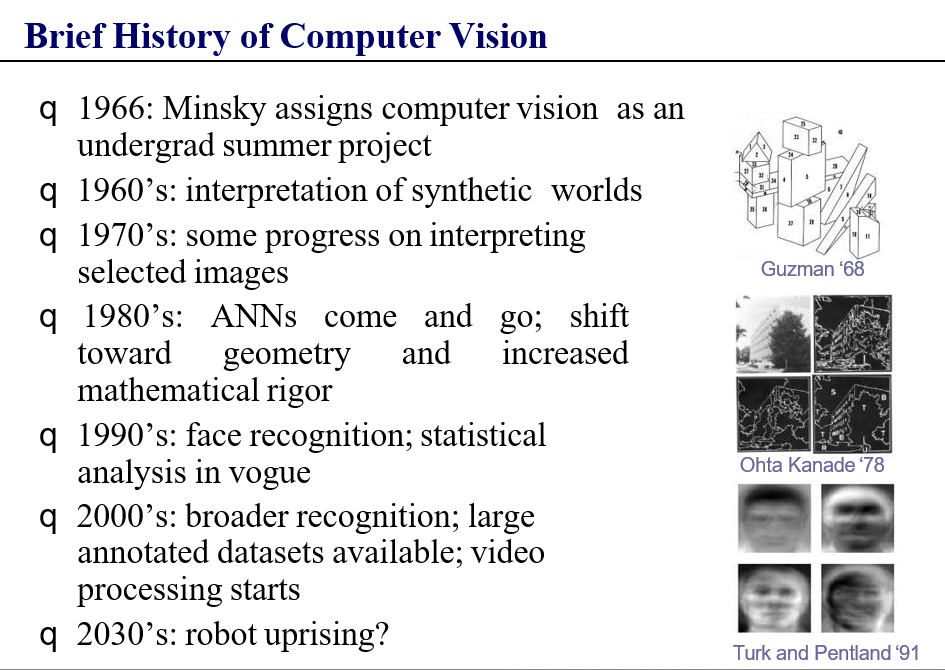

***

###  Human Vision 人类视觉

PPT p42

> **\[Vision is the process of discovering what is present in the world and where it is by looking]**
> 视觉是通过观察发现世界上存在什么以及它在哪里的过程

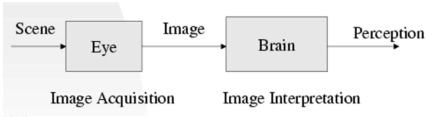

***

###  Computer Vision 计算机视觉

PPT p43

> **\[Computer Vision is the study of analysis of pictures and	videos in order to achieve results similar to those as by humans]**
> 计算机视觉是一门对图片和视频进行分析的研究，目的是为了获得与人类（视觉）类似的结果

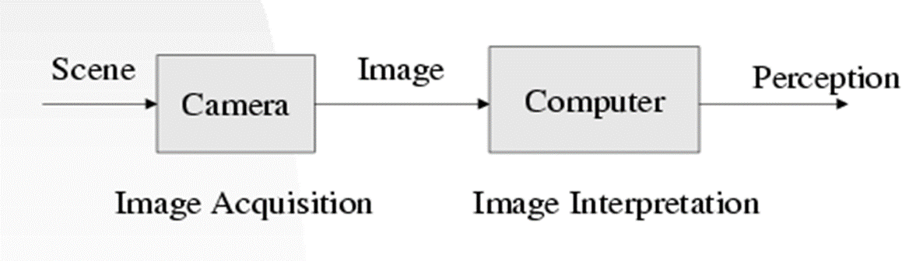

***

###  Image 图像

PPT p44

> **\[An image is a rectangular grid of data of light values]**
> 图像是光值（亮度值）数据的矩形网格

此处给出的定义在PPT中指代灰度图像，更严格的定义应该是

> 图像是像素的矩阵网格。像素的值可以是二进制、灰度、颜色或多模态等。（见PPT p48）

***

###  Main Goal of Computer Vision

PPT p64

> **\[Need for an algorithm that can write the rules for us so  that we don’t have to write it by hand.]**
> 需要一种可以自己寻找规则的算法，这样就无需手动编写了。
> **\[Instead of creating object  models, hundreds of  thousands of pictures were  collected from the internet  and an algorithm was used.]**
> 不创建具体的模型，而是从网络上收集大量图片，使用算法（来学习规则）

***

###  Computer Vision Techniques

PPT p67

> **\[Classification, Semantic Segmentation, Object Detection, Instance Segmentation]**
> 分类，语义分割，目标检测，实例分割

***

###  Convolution 卷积

PPT p69

> **\[未给出原始定义]**

Problems in processing images with fully connected networks：
全连接网络图像处理中的问题:

-   Too many parameters in the weight matrix -> overfitting
    权重矩阵中参数太多->过拟合

Convolutional neural network solution
卷积神经网络解决方案

-   Local correlation, parameter sharing
    本地关联，参数共享

**卷积的四个基本属性（Basic Properties）：** 卷积核（Kernel）、步幅（Stride）、填充（Padding）、通道（Channel）。

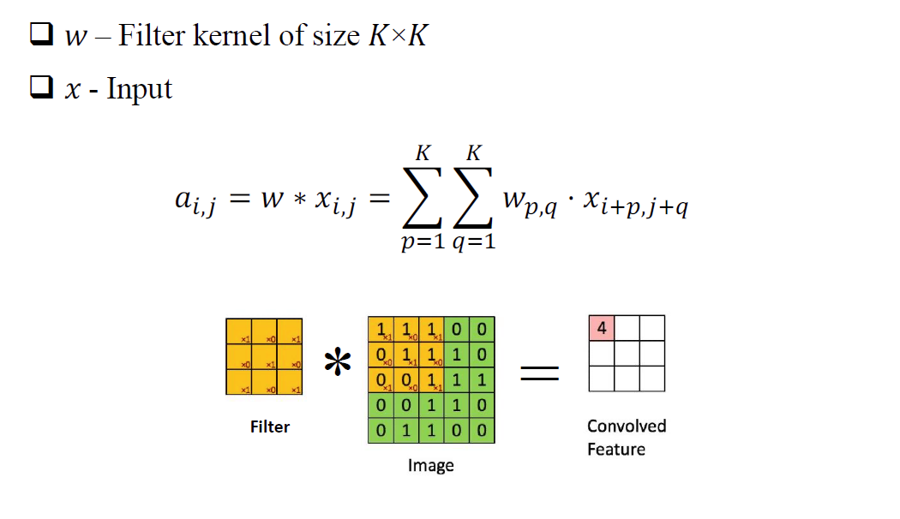

***

###  Kernel卷积核

PPT p71

> **\[Kernel: also known as receptive field, the sense of convolution operation, intuitively understood as a filter matrix, commonly used convolution kernel size of 3 × 3, 5 × 5 and so on;]**
> 卷积核： 也称感受野，是卷积操作的核心。直观地理解为一个滤波器矩阵，常用的卷积核尺寸有3×3、5×5等。

***

###  Stride步幅

PPT p71

> **\[Stride: the pixels moved by the convolution kernel at each step when traversing the feature map]**
> 步幅：在遍历特征图时，卷积核在每一步移动的像素数。步幅决定了卷积操作对输入的采样间隔。

***

###  Padding填充

PPT p71

> **\[Padding: the way to deal with the boundary of the feature map. To fill the boundary (generally filled with 0), and then perform the convolution operation, which will make the size of the output feature map the same as the size of the input feature map;]**
> 填充：处理特征图边界的方法。通过在特征图边界填充（通常使用0进行填充），然后进行卷积操作，可以使输出特征图的大小与输入特征图相同。填充有助于保持特征图边缘信息。

***

###  Channel通道

PPT p71

> **\[Channel: the number of channels (layers) of the convolution layer.]**
> 通道：卷积层的通道（层）数

每个通道对输入进行一种特定的卷积操作，多个通道的输出叠加形成最终的输出特征图。

***

###  卷积的计算

PPT p74-p83
Tutorial Solution Q4 & Q5

详见专题子页面：

[卷积计算 - Tutorial Q4&5](https://www.wolai.com/rsHkVTsrDgGLzEoFDN3dSG "卷积计算 - Tutorial Q4&5")

[卷积计算 - Tutorial Q6](https://www.wolai.com/ffL11QjA9XpLJ48xSBm9Td "卷积计算 - Tutorial Q6")

***

###  De-convolution反卷积

PPT p84

> **\[Equivalent to a transposition computation after converting a convolution kernel to a sparse matrix]**
> 相当于将卷积核转换为稀疏矩阵后的转置计算

卷积是把图片弄成特征图，反卷积是把特征图弄成图片

***

###  Dilated/Atrous Convolution 膨胀卷积

PPT p86

> **\[To expand the receptive field, the kernel is "inflated" by inserting spaces between elements inside the convolutional kernel to form a "null convolution" (or inflated convolution), and the kernel to be expanded is indicated by the expansion rate parameter L, i.e., L-1 spaces are inserted between the kernel elements.]**
> 为了扩大感受野，卷积核通过在卷积核内的元素之间插入空白，形成一种“空洞卷积”（或膨胀卷积）。要扩展的卷积核由扩张率参数L指示，即在卷积核元素之间插入L-1个空格。

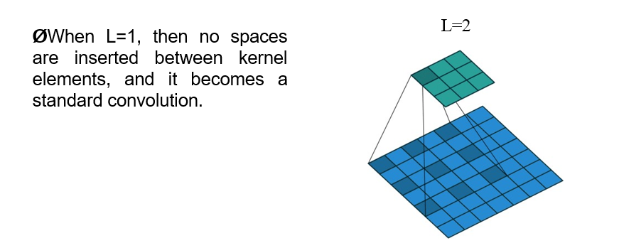

***

###  Pooling 池化

PPT p87

> **\[Pooling is used for regions of the image that do not overlap (this is different from the convolution operation)]**
> 池化操作用于图像中不重叠的区域（与卷积操作不同）

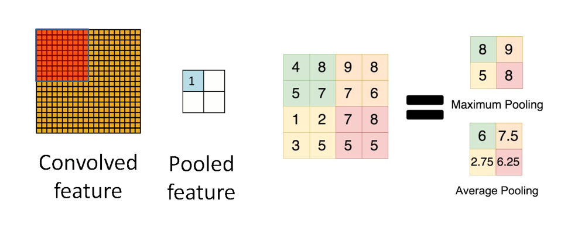

***

###  Flatten压平

PPT p90

> **\[Flatten refers to the process of taking the two-dimensional feature maps produced by the convolution and pooling layers and transforming them into a one-dimensional vector.]**
> "压平"指的是将由卷积和池化层产生的二维特征图转化为一维向量的过程。

***

###  Fully Connect & Dropout

PPT p91

> **\[未给出原始定义]**

**全连接（Fully Connected）**：

将前一层的所有神经元连接到当前层的每个神经元。

用于在神经网络中进行分类或回归。

**Dropout（丢弃）**：

在训练期间随机丢弃一部分神经元，防止网络过度依赖某些特定神经元。有助于减少过拟合并提高模型的泛化能力。

***

###  Normalization正交化/归一化

PPT p92-p93

> **\[Normalization techniques in Convolutional Neural Networks (CNNs) are crucial for improving training stability, accelerating convergence, and achieving better generalization.]**
> 在卷积神经网络（CNNs）中，归一化技术对于提高训练稳定性、加速收敛速度以及实现更好的泛化效果至关重要。

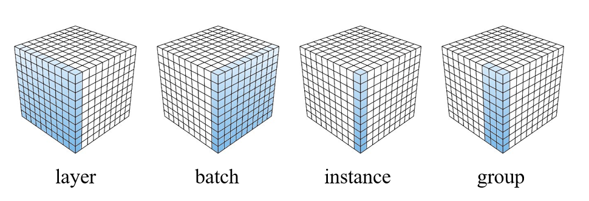

***

###  Feature extraction特征提取

PPT p93-p94

> **\[Feature is a scalar x which is quantitatively describes a property of the Object.]**
> 特征是一个标量x，定量地描述了对象的属性。

> **\[A pattern is represented by a set of N features, or attributes, viewed as a N- dimensional feature vector.]**
> 模式由一组N个特征或属性表示，这些特征或属性被视为N维特征向量。

> **\[Class is a set of patterns that share some common properties]**
> 类型是拥有一些公共属性的模式的集合

> **\[Classification is a mathematical function or algorithm which assigns a feature to one of the classes.]**
> 分类是一种数学函数或算法，将一个特征分配给一个类型。

**Good features:**

-   Objects from the same class have similar feature values.
    同类物体值相同
-   Objects from different classes have different values.
    不同类物体值不同

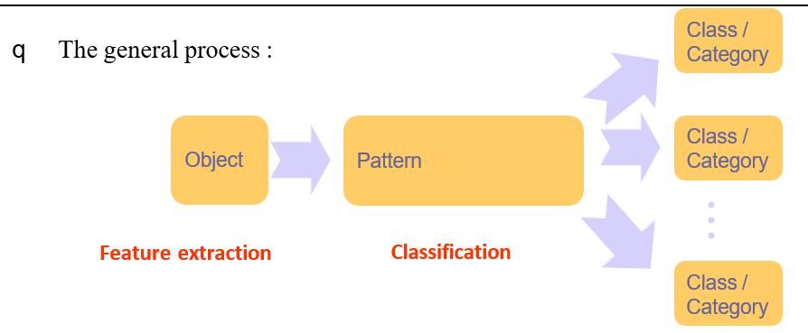

***

###  Image Classification图像分类

PPT p97

> **\[Given a set of pixels determine the category of image]**
> 给定一组像素，确定该图像的类别

***

###  Steps to build a computer vision model

PPT p98
Tutorial Solution Q2

> **\[Data collection: Collect all possible data that is related to the goal of the model]**
> 数据收集：收集与模型目标相关的所有可能的数据

> **\[Data cleaning: Filter thecollected data and remove unclear pictures]**
> 数据清理：对收集到的数据进行过滤，去除不清晰的图片

> **\[Data preparation: Resize all the pictures to one common size]**
> 数据准备：将所有图片调整为一个通用大小

> **\[Build and train the model: Start coding]**
> 构建和训练模型：开始写代码

> *\[classification or recognition (making sense of the visual information).]
> 分类或识别：使视觉信息有意义*

***

###  Deep Learning based Image Classification

PPT p100

**Cascade of Non-linear Transformations（非线性变换的级联）**：

**含义：** 一系列非线性变换的级联，其中输入数据通过一系列非线性操作或转换，逐渐被映射到更高级别的表示。这在深度学习中很常见，因为深层神经网络的每一层都可以看作对输入数据的一种非线性变换。

**End-to-End Learning（端到端学习）**：

**含义：** 整个系统的学习过程，从输入直接到输出，没有人为设计的中间步骤或特征。在端到端学习中，模型尽可能地从原始输入到最终目标输出进行学习，而无需手工设计中间阶段的特征提取或转换。

**General Framework (Any Hierarchical Model is Deep)（通用框架，任何分层模型都是深度的）**：

**含义：** 深度学习中的一般性框架，其中任何具有分层结构的模型都可以被认为是深度模型。深度模型通常包含多个层次的表示学习，这使得模型能够逐渐学习数据的抽象表示。

> Q：为什么需要很多层？

> A：When input has hierarchical structure, the use of a hierarchical architecture is  potentially more efficient because intermediate computations can be re-used. DL architectures are efficient  also  because  they  use  distributed  representations which are shared across classes.
> 当输入具有分层结构时，使用分层架构可能更有效，因为中间计算可以被重复利用。深度学习架构也是高效的，因为它们使用分布式表示，这些表示在不同类别之间是共享的。

***

###  常用的图像分类网络

PPT p105

LeNet、AlexNet、VGG、ResNet、YOLO9000、DenseNet

***

###  Performance Metrics性能指标

PPT p126

> **\[未给出原始定义]**

用以评测模型的准确度和精确度。

**True/False Positive/Negative：** 模型正确/错误预测正/负类别的数量。

**Precision（精确度）**：TP/(TP+FP) - what percentage of the positive class is actually positive?
表示被模型正确分类为正类别的样本数量与模型所有预测为正类别的样本数量之比。

**Recall（召回率）：** TP/(TP+FN) - what percentage of the positive class gets captured by the model?
表示实际正类别样本中被模型正确分类的数量与所有实际正类别样本的数量之比。

**Accuracy（准确率）：**(TP+TN)/(TP+FP+TN+FN) - what percentage of predictions are correct?
是模型正确分类的图像数量与总图像数量之比。

***

###  Confusion Matrix混淆矩阵

PPT p128

> **\[未给出原始定义]**

Good for checking where your model is incorrect
用于检查模型不正确的地方

For multi-class classification it reflects which classes are correlated
对于多类别的分类，它反映了哪些类型是相关的

***

###  Segmentation 分割

PPT p133

> **\[Segmentation is the process of breaking an image into groups, based on similarities of the pixels]**
> 分割是根据像素的相似性将图像分成组的过程

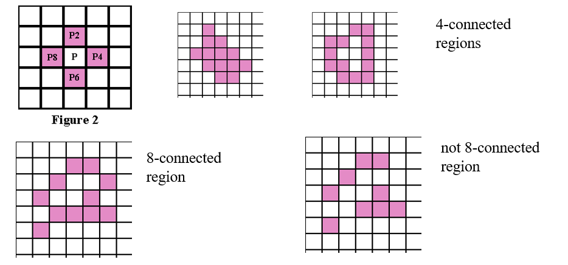

***

###  Object Recognition

PPT p144
Tutorial Solution Q3

> **\[It is	the task of finding	and	identifying objects in an image or video sequence]**
> 是在图像或视频序列中寻找和识别物体的任务

**步骤：**

Detection – of separate objects
Description – of their geometry and positions in 3D
Classification – as being one of a known class
Identification – of the particular instance
Understanding – of spatial relationships between objects

分离物体的检测
在3D中描述它们的几何形状和位置
分类为已知类别之一
特定实例的标识
理解物体之间的空间关系

**应用：**

It is used in various applications, such as autonomous navigation (recognizing obstacles), augmented reality (overlaying digital information on real-world objects), and robotics (identifying objects for manipulation).

它被用于各种应用程序，例如自主导航(识别障碍物)、增强现实(将数字信息覆盖在现实世界的对象上)和机器人(识别用于操作的对象)。

***

添加新的概念
